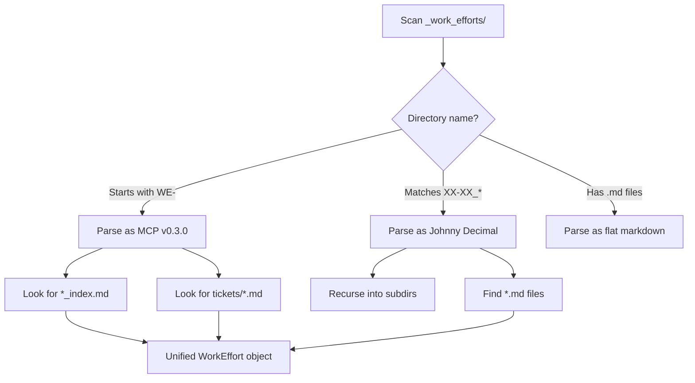

# Mission Control Dashboard (Revised)

## Key Changes from v1

1. **Dual format support** - Parse both Johnny Decimal and WE-YYMMDD-xxxx formats
2. **Proper dependencies** - Added `gray-matter` for frontmatter parsing
3. **Debounced updates** - Batch rapid file changes (300ms window)
4. **Initial state push** - Send full state on WebSocket connect
5. **Graceful shutdown** - Clean up watchers on SIGINT/SIGTERM
6. **Reconnection with backoff** - Client reconnects 1s, 2s, 4s, 8s... max 30s

---

## Dual Format Detection



### Unified Data Model

```typescript
interface WorkEffort {
  id: string;              // "WE-251227-a1b2" or "10.01"
  format: "mcp" | "jd";    // Which format it came from
  title: string;
  status: string;
  path: string;
  created?: string;
  tickets?: Ticket[];      // MCP format only
  content?: string;        // JD format - full markdown
}

interface Ticket {
  id: string;              // "TKT-a1b2-001"
  title: string;
  status: string;
  path: string;
}
```

---

## File Structure

```
mcp-servers/dashboard/
├── server.js              # Main server (Express + WS + chokidar)
├── lib/
│   ├── parser.js          # Dual-format parsing logic
│   └── watcher.js         # Debounced file watcher wrapper
├── package.json           
├── config.json            # Repos to monitor
├── public/
│   ├── index.html         # Dashboard shell
│   ├── styles.css         # Fogsift theme
│   └── app.js             # Client with reconnection logic
└── README.md
```

---

## Dependencies

```json
{
  "dependencies": {
    "express": "^4.18.2",
    "ws": "^8.14.2",
    "chokidar": "^3.5.3",
    "gray-matter": "^4.0.3"
  }
}
```

---

## Server Architecture

### Debounced Watcher ([`lib/watcher.js`](mcp-servers/dashboard/lib/watcher.js))

```javascript
// Batch file changes within 300ms window
// Emit single "update" event with changed repo name
```

### Parser ([`lib/parser.js`](mcp-servers/dashboard/lib/parser.js))

```javascript
// parseRepo(repoPath) -> { workEfforts: WorkEffort[] }
// - Detect format by directory name patterns
// - Use gray-matter for frontmatter extraction
// - Return unified WorkEffort objects
```

### Main Server ([`server.js`](mcp-servers/dashboard/server.js))

```javascript
// 1. Load config.json
// 2. Create watcher for each repo
// 3. On change: re-parse affected repo, broadcast to clients
// 4. On WS connect: send full current state
// 5. Graceful shutdown: close watchers, close WS, exit
```

---

## WebSocket Protocol

### Server to Client

```javascript
// Initial state on connect
{ type: "init", repos: { "_pyrite": [...], "fogsift": [...] } }

// Incremental update
{ type: "update", repo: "_pyrite", workEfforts: [...] }

// Repo added/removed
{ type: "repo_change", action: "added"|"removed", repo: "name" }
```

### Client to Server

```javascript
// Optional: client can request refresh
{ type: "refresh", repo: "_pyrite" }
```

---

## Client Reconnection

```javascript
// Exponential backoff: 1s, 2s, 4s, 8s, 16s, 30s (max)
// Visual indicator when disconnected
// Auto-refresh state on reconnect
```

---

## UI States

| State | Display |
|-------|---------|
| **Loading** | Skeleton cards with pulse animation |
| **Connected** | Green dot indicator |
| **Disconnected** | Red dot + "Reconnecting..." badge |
| **Empty repo** | "No work efforts found" message |
| **Error** | Red banner with error message |

---

## Styling Tokens (from fogsift)

```css
:root {
  --bg-primary: #1a1412;
  --bg-card: #0f0b09;
  --text-primary: #f5f0e6;
  --text-muted: #a8998a;
  --accent: #fb923c;
  --accent-hover: #fdba74;
  --border: #3d2e26;
  --success: #059669;
  --warning: #d97706;
  --error: #dc2626;
  --font-mono: 'JetBrains Mono', 'Fira Code', monospace;
}
```

---

## Config Format

```json
{
  "port": 3847,
  "repos": [
    {
      "name": "_pyrite",
      "path": "/Users/ctavolazzi/Code/active/_pyrite"
    }
  ],
  "debounceMs": 300
}
```

---

## API Endpoints

| Endpoint | Method | Purpose |
|----------|--------|---------|
| `GET /` | GET | Serve dashboard |
| `GET /api/repos` | GET | List repos with current state |
| `GET /api/repos/:name` | GET | Get single repo state |
| `POST /api/repos` | POST | Add new repo to watch |
| `DELETE /api/repos/:name` | DELETE | Remove repo from watch |
| `GET /api/health` | GET | Server health check |

---

## Error Handling

| Scenario | Behavior |
|----------|----------|
| Repo path doesn't exist | Log warning, skip repo, show in UI |
| `_work_efforts/` missing | Show "No work efforts folder" in UI |
| Parse error in markdown | Log error, skip file, continue |
| WebSocket disconnect | Client auto-reconnects with backoff |
| Port in use | Try next port (3848, 3849...) or fail with clear message |

---

## Scope

### MVP (this build)
- Dual format parsing (JD + MCP)
- Multi-repo support (start with one)
- Real-time updates with debouncing
- Clean dark theme UI
- Connection status indicator
- Graceful shutdown

### Deferred (v2)
- Settings UI for adding repos
- Activity feed / changelog
- Search/filter work efforts
- Keyboard shortcuts
- Export functionality

---

## Bug Fix Still Required

[`mcp-servers/work-efforts/server.js`](mcp-servers/work-efforts/server.js) lines 104, 418:

```javascript
// FROM:
const workEffortsDir = path.join(repoPath, '_work_efforts_');
// TO:
const workEffortsDir = path.join(repoPath, '_work_efforts');
```

---

## Execution Order

1. Fix MCP server folder name bug (quick win)
2. Create `mcp-servers/dashboard/` structure
3. Build parser with dual-format support
4. Build debounced watcher
5. Build Express server with WS
6. Build HTML/CSS shell
7. Build client JS with reconnection
8. Test end-to-end
9. Add README