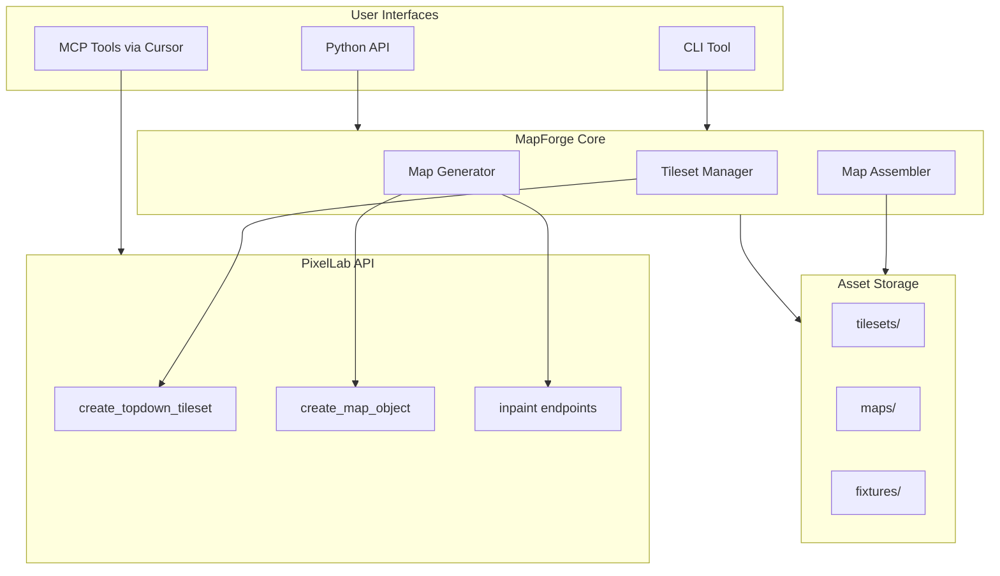

# PixelLab Map Maker

## Architecture Overview



## Components

### 1. Project Structure

Create `projects/mapforge/` following the existing pattern:

```
projects/mapforge/
├── __init__.py
├── mapforge.py          # Main Python API
├── tileset_manager.py   # Tileset generation & management
├── map_generator.py     # Direct map generation with inpainting
├── map_assembler.py     # Compose tiles into maps
├── cli.py               # CLI interface
├── README.md
├── requirements.txt
├── assets/
│   ├── tilesets/        # Generated Wang tilesets
│   ├── maps/            # Assembled map PNGs
│   └── init_images/     # Template init images
└── tests/
    └── test_mapforge.py
```

### 2. Tileset Manager (`tileset_manager.py`)

Wraps PixelLab's `create_topdown_tileset` API to:

- Generate connected Wang tilesets (ocean -> beach -> grass -> stone)
- Chain tilesets using `lower_base_tile_id` / `upper_base_tile_id`
- Store and retrieve tilesets locally
- Poll background jobs until completion

Key methods:

```python
class TilesetManager:
    def create_terrain_chain(self, terrains: list[str]) -> dict
    def get_tileset(self, tileset_id: str) -> dict
    def save_tileset_images(self, tileset_id: str, output_dir: Path) -> list[Path]
```

### 3. Map Generator (`map_generator.py`)

Implements the workflow from the PixelLab documentation:

- Start with init image (sketch/template)
- Generate initial 4x4 tile area with description
- Expand map by selecting overlapping regions
- Use inpainting to add details and fix areas

Key methods:

```python
class MapGenerator:
    def create_initial_region(self, init_image: Path, description: str) -> MapRegion
    def expand_region(self, existing_map: MapRegion, direction: str, description: str) -> MapRegion
    def inpaint_area(self, map_region: MapRegion, mask: Path, description: str) -> MapRegion
```

### 4. Map Assembler (`map_assembler.py`)

Combines generated tiles/regions into complete maps:

- Stitch tiles based on Wang tileset rules
- Composite map regions with proper overlap handling
- Export final PNG at various scales

Key methods:

```python
class MapAssembler:
    def create_map_from_tileset(self, tileset_id: str, layout: list[list[int]], tile_size: int) -> Image
    def stitch_regions(self, regions: list[MapRegion]) -> Image
    def export_png(self, map_data: Image, output_path: Path, scale: int = 1) -> Path
```

### 5. Main API (`mapforge.py`)

High-level interface combining all components:

```python
from mapforge import MapForge

mf = MapForge()

# Workflow 1: Tileset-based
tileset = mf.create_tileset_chain(["ocean water", "sandy beach", "grass"])
map_img = mf.generate_map_from_tileset(tileset, width=10, height=10)
mf.save_map(map_img, "beach_map.png")

# Workflow 2: Direct generation
region = mf.generate_region("stairs in a cave", init_image="cave_sketch.png")
region = mf.expand_region(region, direction="right", description="treasure chest area")
mf.save_map(region.image, "cave_map.png")
```

### 6. CLI (`cli.py`)

Simple command-line interface:

```bash
# Generate tileset chain
python -m mapforge tileset create "ocean" "beach" "grass" --output tilesets/terrain

# Generate map from tileset
python -m mapforge map from-tileset tilesets/terrain --width 10 --height 10 --output maps/beach.png

# Direct map generation
python -m mapforge map generate "cave with stairs" --init-image sketches/cave.png --output maps/cave.png
```

## Integration Points

### Existing Code to Leverage

- [pixellab_client.py](projects/api-testing-framework/pixellab_client.py) - Mock/live pattern, API structure
- [config.py](projects/api-testing-framework/config.py) - API configuration system

### PixelLab MCP Tools Available

- `create_topdown_tileset` - Wang tileset generation (primary)
- `create_map_object` - Objects with transparent backgrounds
- `get_topdown_tileset` - Retrieve tileset status/results
- `create_isometric_tile` - For future isometric support

### API Endpoints to Use

| Endpoint | Purpose |

|----------|---------|

| `/create-topdown-tileset` | Wang tileset generation |

| `/background-jobs/{id}` | Poll async job status |

| `/inpaint` | Modify existing map regions |

| `/generate-image-v2` | Initial region generation |

## Implementation Order

1. **Phase 1: Tileset Manager** - Core tileset generation with existing MCP tools
2. **Phase 2: Map Assembler** - Stitch tiles into maps, PNG export
3. **Phase 3: Map Generator** - Direct generation with inpainting workflow
4. **Phase 4: CLI** - Command-line interface
5. **Phase 5: Polish** - Documentation, tests, examples

## Output Format

Initial release: PNG images

- Individual tiles as separate PNGs
- Assembled map as single PNG
- Metadata JSON (tile positions, tileset IDs)

Future extensions (not in this phase):

- Tiled (.tmx) export
- Godot TileSet resource
- Unity