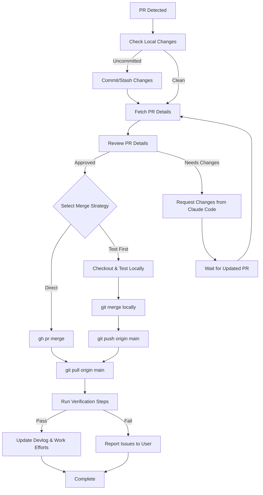

# PR Integrat

ion Workflow Plan

## Objective

Create a reliable, repeatable process for incorporating PRs from Claude Code (cloud) into the local _pyrite repository. This ensures safe integration, proper verification, and maintains repository hygiene.

## Current State Analysis

**Ready:**

- GitHub CLI authenticated (`gh`) with proper scopes
- Git configured with `main` and `develop` branches
- Remote: `origin` → `https://github.com/ctavolazzi/_pyrite.git`
- Workflow documented in [`_coordination/CURSOR_CONTINUATION_PROMPT.md`](_coordination/CURSOR_CONTINUATION_PROMPT.md)

**Needs Attention:**

- Uncommitted local changes (1 modified file, many untracked files)
- No automated PR detection/notification system

## Implementation Plan

### Phase 1: Pre-PR Preparation

**1.1 Clean Up Local Changes**

- Review modified file: `_docs/20-29_development/architecture_category/architecture.02_core_data_structures_algorithms.md`
- If changes are valuable: commit with message `docs: update architecture documentation`
- If changes are temporary: stash with `git stash push -m "temp: local architecture doc edits"`
- Handle untracked files:
- Work effort tickets: These are local-only tracking files, safe to leave untracked
- Sandbox files: Review and either commit or add to `.gitignore`
- Other files: Evaluate each and commit/stash/ignore as appropriate

**1.2 Ensure Clean Working State**

- Run `git status` to confirm clean state
- Run `git fetch origin` to sync remote refs
- Verify branch: `git branch --show-current` should be `main` or `develop`

### Phase 2: PR Detection and Review

**2.1 Check for Open PRs**

```bash
gh pr list --state open --repo ctavolazzi/_pyrite
```

**2.2 Review PR Details**For each open PR:

- View PR: `gh pr view <PR_NUMBER> --web` or `gh pr view <PR_NUMBER>`
- Check:
- PR title and description
- Files changed: `gh pr diff <PR_NUMBER>`
- Commits: `gh pr view <PR_NUMBER> --json commits`
- Work effort references (if any)
- Target branch (should be `main` or `develop` per Git Flow)

**2.3 Validate PR Context**

- Check if PR references work effort IDs (WE-YYMMDD-xxxx format)
- Verify PR aligns with expected changes (e.g., v0.9.0 implementation)
- Review any breaking changes or migration requirements

### Phase 3: Safe Merge Process

**3.1 Pre-Merge Checklist**

- [ ] Local changes committed or stashed
- [ ] PR reviewed and understood
- [ ] Target branch confirmed (main vs develop)
- [ ] No merge conflicts expected
- [ ] Backup current state (optional but recommended)

**3.2 Merge StrategyOption A: Direct Merge (if PR targets main and we're on main)**

```bash
git checkout main
git pull origin main  # Ensure we're up to date
gh pr checkout <PR_NUMBER>  # Checkout PR branch locally
# Review/test locally
git checkout main
gh pr merge <PR_NUMBER> --merge  # Merge via GitHub API
git pull origin main  # Pull merged changes
```

**Option B: Local Merge (if we want to test first)**

```bash
git checkout main
git pull origin main
gh pr checkout <PR_NUMBER>  # Checkout PR branch
# Test locally
git checkout main
git merge <PR_BRANCH_NAME>  # Merge locally
git push origin main  # Push merged state
gh pr close <PR_NUMBER>  # Close PR (already merged)
```

**Option C: Squash Merge (if PR has many small commits)**

```bash
gh pr merge <PR_NUMBER> --squash
git pull origin main
```

**3.3 Handle Merge Conflicts**If conflicts occur:

- Abort merge: `git merge --abort`
- Report conflicts to user
- Manually resolve or request Claude Code to rebase

### Phase 4: Post-Merge Verification

**4.1 Git Verification**

- Verify merge: `git log --oneline -5`
- Check status: `git status` (should be clean)
- Verify branch state: `git branch -vv`

**4.2 Dashboard Verification (if applicable)**If PR affects `mcp-servers/dashboard-v3/`:

- Check if dashboard is running: `curl -s http://localhost:3848/`
- If not running, start it:
  ```bash
      cd mcp-servers/dashboard-v3
      pkill -f "node.*dashboard-v3" 2>/dev/null
      npm run dev
  ```


- Use browser tools to verify:
- Navigate to `http://localhost:3848`
- Take snapshot: `browser_snapshot`
- Check version number in UI
- Verify new features (if any)
- Check console for errors

**4.3 Code Verification**

- Run health checks: `python3 tools/github-health-check/check.py`
- Run structure check: `python3 tools/structure-check/check.py`
- Run obsidian linter (if markdown changed): `python3 tools/obsidian-linter/lint.py --scope _work_efforts`

### Phase 5: Documentation and Logging

**5.1 Update Devlog**Add entry to [`_work_efforts/devlog.md`](_work_efforts/devlog.md):

```markdown
### YYYY-MM-DD HH:MM - PR #XX Merged - [Description]

**PR:** [#XX - Title](https://github.com/ctavolazzi/_pyrite/pull/XX)
**Commit:** `<commit-hash>`

**What was delivered:**
- [List key changes]

**Tickets Completed:**
- ✅ TKT-xxxx-001: [Description]
- ✅ TKT-xxxx-002: [Description]

**Verification:**
- [ ] Git merge successful
- [ ] Dashboard running (if applicable)
- [ ] Health checks passing
- [ ] No regressions detected
```

**5.2 Update Work Efforts (if PR references them)**

- Use MCP work-efforts tools to update ticket statuses
- Mark related work efforts as completed if all tickets done
- Add commit hash to tickets: `mcp_work-efforts_update_ticket`

**5.3 Update CURSOR_CONTINUATION_PROMPT.md**

- Update "Last merged" PR number
- Update "Current Version" if version changed
- Update any state information

## Workflow Diagram




## Error Handling

**Scenario 1: Merge Conflicts**

- Abort merge immediately
- Report conflicts to user with file list
- Option: Request Claude Code to rebase PR

**Scenario 2: Verification Failures**

- Document what failed
- Revert merge if critical: `git revert <merge-commit>`
- Report to user with specific failure details

**Scenario 3: PR Targets Wrong Branch**

- Do not merge
- Report to user
- Request Claude Code to retarget PR

## Automation Opportunities (Future)

- Script to check for new PRs periodically
- Auto-merge for low-risk PRs (with approval)
- Automated verification test suite
- PR notification system

## Files to Modify

1. [`_work_efforts/devlog.md`](_work_efforts/devlog.md) - Add PR merge entries
2. [`_coordination/CURSOR_CONTINUATION_PROMPT.md`](_coordination/CURSOR_CONTINUATION_PROMPT.md) - Update state after merges
3. Work effort tickets (via MCP) - Update statuses if PR references them

## Success Criteria

- PR merged without conflicts
- Local repository in clean state
- All verification checks pass