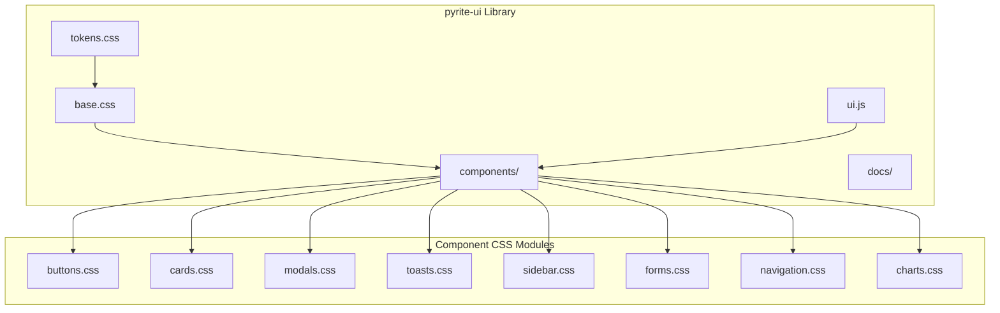

# _pyrite UI Library Formalization Plan

Create a modular, documented UI library extracted from the existing Mission Control dashboard. The library will live in `mcp-servers/dashboard/lib/pyrite-ui/` and be consumable by future dashboards or tools.

---

## Architecture



---

## Directory Structure

```
mcp-servers/dashboard/lib/pyrite-ui/
├── pyrite-ui.css          # Main entry (imports all)
├── tokens.css             # Design tokens (colors, spacing, etc.)
├── base.css               # Reset, typography, utilities
├── components/
│   ├── buttons.css
│   ├── cards.css
│   ├── modals.css
│   ├── toasts.css
│   ├── sidebar.css
│   ├── forms.css
│   ├── navigation.css
│   └── charts.css
├── ui.js                  # JS helpers (createToast, openModal, etc.)
└── docs/
    ├── index.html         # Component catalog/preview page
    └── README.md          # Usage documentation
```

---

## Phase 1: Design Tokens Extraction

Extract CSS variables from [styles.css](mcp-servers/dashboard/public/styles.css) lines 1-69 into `tokens.css`:

- Color palette (backgrounds, text, accents, status colors)
- Typography (font families, sizes)
- Spacing scale
- Border radii
- Shadows
- Motion/transitions

---

## Phase 2: Base Styles

Create `base.css` with:

- CSS reset (already have box-sizing, margin/padding reset)
- Typography defaults
- Utility classes (`.hidden`, `.truncate`, `.visually-hidden`)
- Animation keyframes (pulse, slide-in, fade, etc.)

---

## Phase 3: Component Modules

Extract and organize by component type:

| Module | Source Lines (approx) | Key Classes |
|--------|----------------------|-------------|
| `buttons.css` | ~100 lines | `.btn`, `.action-btn`, `.filter-btn`, `.status-btn` |
| `cards.css` | ~150 lines | `.stat-card`, `.queue-item`, `.panel-section` |
| `modals.css` | ~200 lines | `.modal-overlay`, `.modal`, `.modal-header/body/footer` |
| `toasts.css` | ~100 lines | `.toast-container`, `.toast`, `.toast-success/error/info` |
| `sidebar.css` | ~300 lines | `.sidebar`, `.tree-nav`, `.tree-item`, `.brand` |
| `forms.css` | ~80 lines | `.search-box`, input styles, select styles |
| `navigation.css` | ~150 lines | `.site-nav`, `.topbar`, `.breadcrumb`, `.tabs` |
| `charts.css` | ~100 lines | `.chart-container`, progress rings, sparklines |

---

## Phase 4: JavaScript Utilities

Create `ui.js` with programmatic helpers:

```javascript
// Example API
const PyUI = {
  toast(message, type = 'info', duration = 4000),
  modal(options),           // { title, body, actions }
  confirm(message),         // returns Promise<boolean>
  notify(title, message),   // notification panel
  loading(show = true),     // global loading state
};
```

Extract from current [app.js](mcp-servers/dashboard/public/app.js) toast/modal logic.

---

## Phase 5: Documentation

Create `docs/index.html` - a live component catalog showing:

- Color swatches
- Typography samples  
- Button variants
- Card layouts
- Modal examples
- Toast demos

Plus `README.md` with:

- Installation/usage
- CSS variable customization
- JavaScript API reference

---

## Migration Path

After library is created:

1. Update `public/index.html` to import `pyrite-ui.css` instead of `styles.css`
2. Move existing `styles.css` to backup
3. Keep page-specific overrides in a slim `dashboard.css`

---

## Estimated Effort

| Phase | Time |
|-------|------|
| Tokens extraction | 30 min |
| Base styles | 30 min |
| Component modules (8) | 2-3 hours |
| JS utilities | 1 hour |
| Documentation | 1-2 hours |
| **Total** | **5-7 hours** |

---

## Key Files to Modify/Create

**Create:**
- `mcp-servers/dashboard/lib/pyrite-ui/` (entire directory)

**Modify:**
- [public/index.html](mcp-servers/dashboard/public/index.html) - update CSS imports
- [public/app.js](mcp-servers/dashboard/public/app.js) - extract UI helpers

**Preserve:**
- [public/styles.css](mcp-servers/dashboard/public/styles.css) - keep as backup initially