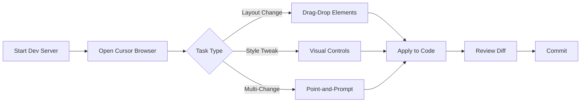

# Visual Editor Workflow Integration Plan

## Overview

Cursor's visual editor (released Dec 11, 2025) provides drag-and-drop layout manipulation, prop inspection, visual property controls, and point-and-prompt capabilities. This plan identifies how to leverage these features for the How To Win Capitalism project.

---

## High-Value Use Cases

### 1. Hero Section Iteration

The [`Hero.astro`](src/components/organisms/Hero.astro) component has multiple configurable props that would benefit from visual editing:

```astro
tagline?: string;
subtitle?: string;
ctaText?: string;
ctaLink?: string;
showScrollIndicator?: boolean;
```

**Visual Editor Benefits:**

- Test different tagline/subtitle text combinations live
- Adjust padding and spacing with sliders
- Fine-tune CTA button colors using color picker
- Toggle scroll indicator visibility in sidebar

### 2. TopicCard Grid Layouts

[`TopicCard.astro`](src/components/molecules/TopicCard.astro) is used throughout the wiki for navigation. Visual editor enables:

- Drag-and-drop reordering of cards without editing source
- Live preview of different grid configurations (1-col vs 2-col)
- Test tag/icon combinations visually
- Point at a card and prompt "make the border thicker" or "increase padding"

### 3. Auth Form Refinement

The auth components in `src/components/auth/` have complex layouts:

| Component | Visual Editor Use |

|-----------|-------------------|

| `LoginForm.astro` | Adjust input spacing, button sizing |

| `RegisterForm.astro` | Rearrange field order, test validation states |

| `ForgotPasswordForm.astro` | Tweak form width, message positioning |

### 4. Profile Page Layout

[`src/pages/profile/[id].astro`](src/pages/profile/[id].astro) and related components:

- Rearrange profile sections (header, activity feed, bulletin)
- Test different spacing between elements
- Point-and-prompt for quick style changes

### 5. Design Token Iteration

[`Base.astro`](src/layouts/Base.astro) defines the design system CSS variables:

```css
--color-bg: #ffffff;
--color-text: #202122;
--color-link: #0645ad;
--color-border: #a2a9b1;
--color-surface: #f8f9fa;
```

**Visual Editor Benefits:**

- Live color picker for palette refinement
- Slider controls for spacing tokens
- See changes reflected across all components instantly

---

## Recommended Workflow



### Step-by-Step

1. **Start dev server:** `npm run dev` (already running on port 4321)
2. **Open Cursor Browser:** Navigate to `localhost:4321`
3. **Select editing mode:**

   - **Drag-and-drop** for structural changes
   - **Sidebar controls** for precise style adjustments
   - **Point-and-prompt** for multiple parallel changes

4. **Apply changes:** Let the agent update underlying code
5. **Review diff:** Verify changes match intent
6. **Commit:** Standard git workflow

---

## Component Priority for Visual Editing

| Priority | Component | Reason |

|----------|-----------|--------|

| High | `Hero.astro` | Prominent, many configurable props |

| High | `TopicCard.astro` | Used everywhere, layout-sensitive |

| High | `LoginForm.astro` | User-facing, UX-critical |

| Medium | `ProfileHeader.astro` | Complex layout |

| Medium | `WikiBox.astro` | Multiple variants |

| Low | `Footer.astro` | Rarely changes |

---

## Point-and-Prompt Examples

Specific prompts you can use while clicking elements:

| Click On | Prompt | Expected Result |

|----------|--------|-----------------|

| Hero CTA button | "make this more prominent" | Larger padding, bolder styling |

| TopicCard tag | "change this to red for 'New' items" | Conditional color styling |

| Login form | "center this vertically" | Flexbox centering applied |

| Profile avatar | "make this 20% larger" | Width/height increase |

| Footer disclaimer | "reduce the font size" | Font size decrease |

---

## Integration with Current Workflow

The visual editor complements your existing process:

1. **Documentation:** Continue using `_docs/devlog/` for tracking changes
2. **Work Efforts:** Log visual editing sessions in `_work_efforts/` if significant
3. **Commits:** Use conventional commits (`feat: adjust hero layout via visual editor`)
4. **Testing:** Visual changes still need E2E test verification

---

## Limitations to Note

| Limitation | Impact | Workaround |

|------------|--------|------------|

| Astro components render server-side | Some props may not be editable live | Focus on CSS/layout changes |

| Mock auth won't show real states | Can't test all auth UI states | Use manual login first |

| No React | Prop inspection limited | Rely on Astro prop definitions |

---

## Next Steps

1. **Try it now:** Open Cursor Browser on `localhost:4321`, click on Hero section, adjust via sidebar
2. **Document findings:** Log what works well in today's devlog
3. **Establish patterns:** Identify which components benefit most from visual editing
4. **Share with future sessions:** Update `.cursorrules` if specific visual editor conventions emerge