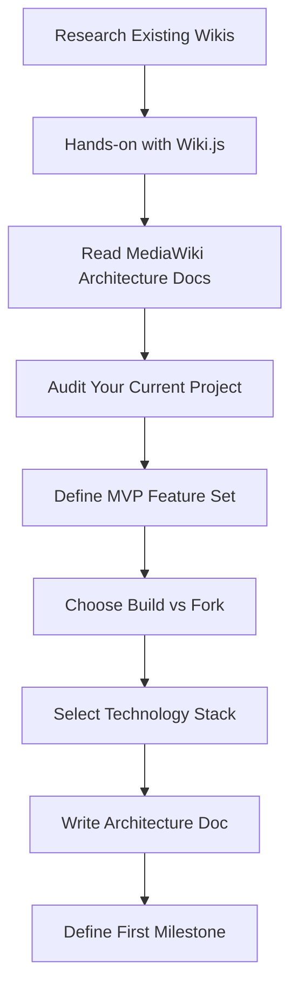

# Wiki Platform Investigation Plan

Before writing code, investigate the landscape and make informed decisions about architecture, scope, and approach.

## Investigation Areas

### 1. Existing Solutions Analysis

Research what already exists and learn from it:

| Platform | Type | Key Learning |

|----------|------|--------------|

| MediaWiki | Open source (PHP) | Powers Wikipedia - understand why it works |

| Wiki.js | Open source (Node.js) | Modern wiki, good docs, see architecture |

| Notion | Closed source | UX patterns for collaborative editing |

| Confluence | Commercial | Enterprise wiki patterns |

| Obsidian Publish | Hybrid | Markdown-first publishing |

**Questions to answer:**

- What does MediaWiki do that makes Wikipedia work?
- What problems do modern wikis (Wiki.js) solve differently?
- What would forking vs building from scratch teach you?

### 2. Core Wikipedia Capabilities Breakdown

Decompose Wikipedia into discrete features and understand each:

```
TIER 1: Essential (MVP)
├── Article CRUD (create, read, update, delete)
├── User accounts and profiles
├── Basic permissions (who can edit what)
└── Search across content

TIER 2: Wiki-like (what makes it a wiki)
├── Edit history / revision tracking
├── Diff viewer (compare versions)
├── Wikilinks (link between articles)
├── Categories and taxonomies
└── Recent changes feed

TIER 3: Collaboration (community features)
├── Talk pages (discussion per article)
├── Watchlists (track articles you care about)
├── User contributions page
└── Edit conflicts resolution

TIER 4: Scale (governance and moderation)
├── Admin tools (protect, block, delete)
├── Vandalism detection
├── Citations / references
└── Quality assessment

TIER 5: Future expansion
├── Forum-style discussions
├── Video content (TikTok-style)
└── Mobile apps
```

**Questions to answer:**

- Which tier do you start with?
- What's the simplest version that's still useful?

### 3. Architecture Patterns Research

Understand how collaborative editing systems work:

**Document Storage**

- Flat files (Markdown/MDX) - your current approach
- Database (PostgreSQL, D1)
- Hybrid (content in files, metadata in DB)

**Revision Tracking**

- Git-based (every edit is a commit)
- Database-based (versions table with diffs)
- Operational Transform / CRDT (real-time collaboration)

**User-Generated Content**

- Static site generation (rebuild on edit)
- Server-side rendering (dynamic)
- Hybrid (static pages, dynamic comments)

**Questions to answer:**

- Do you want real-time collaborative editing (Google Docs style)?
- Or sequential editing (Wikipedia style - edit, save, done)?
- How does your current Astro/Cloudflare stack fit?

### 4. Your Current Project Audit

Evaluate what howtowincapitalism already has:

```
EXISTING IN YOUR PROJECT:
├── User auth (mock, localStorage)
├── User profiles
├── MDX content pages
├── Role-based permissions (RBAC)
├── Cloudflare Pages hosting
└── Basic navigation/search

MISSING FOR WIKI:
├── User-editable content (currently dev-only)
├── Revision history
├── Diff viewer
├── Talk/discussion pages
├── Wikilinks
└── Recent changes
```

**Questions to answer:**

- Extend current project or start fresh?
- How much of your current code is reusable?

### 5. Build vs Fork Decision Matrix

| Factor | Build from Scratch | Fork Wiki.js | Fork MediaWiki |

|--------|-------------------|--------------|----------------|

| Learning | Maximum | Medium | Low (PHP) |

| Time to MVP | Months | Weeks | Days |

| Customization | Total control | Good | Difficult |

| Stack fit | Your choice | Node.js | PHP |

| Community | None | Active | Massive |

| Maintenance | All you | Merge upstream | Complex |

**Questions to answer:**

- What's more valuable: learning or shipping?
- Are you okay with PHP (MediaWiki) or want to stay in JS/TS?

### 6. Technology Decisions

Decisions to make before implementation:

| Decision | Options | Your Current Stack |

|----------|---------|-------------------|

| Framework | Astro, Next.js, SvelteKit | Astro |

| Database | D1, Supabase, PlanetScale | None (files) |

| Auth | Supabase, Clerk, Auth.js, Custom | Custom mock |

| Editor | Markdown, WYSIWYG, Block-based | MDX |

| Hosting | Cloudflare, Vercel, Self-hosted | Cloudflare |

| Search | Pagefind, Algolia, Meilisearch | Basic |

### 7. Closed vs Open Source Strategy

Clarify what "somewhat closed source" means:

**Options:**

- Fully open source (MIT/Apache)
- Open core (base open, premium features closed)
- Source available (visible but not free to use commercially)
- Proprietary with open source dependencies

**Questions to answer:**

- Do you want others to contribute?
- Is this a potential business?
- What are you protecting?

## Deliverables from Investigation

After investigation, you should have:

1. **Feature tier list** - What's in MVP vs later
2. **Architecture decision record** - Choices and why
3. **Build vs fork decision** - With rationale
4. **Technology choices** - Stack decisions
5. **Rough timeline** - Phases and milestones
6. **First milestone definition** - Smallest useful version

## Suggested Investigation Process



## Time Estimate

| Phase | Time |

|-------|------|

| Research existing solutions | 2-4 hours |

| Hands-on with Wiki.js locally | 2-3 hours |

| Feature tier definition | 1-2 hours |

| Architecture decisions | 2-3 hours |

| Write decision document | 1-2 hours |

| **Total investigation** | **8-14 hours** |

This is time well spent before writing any code.