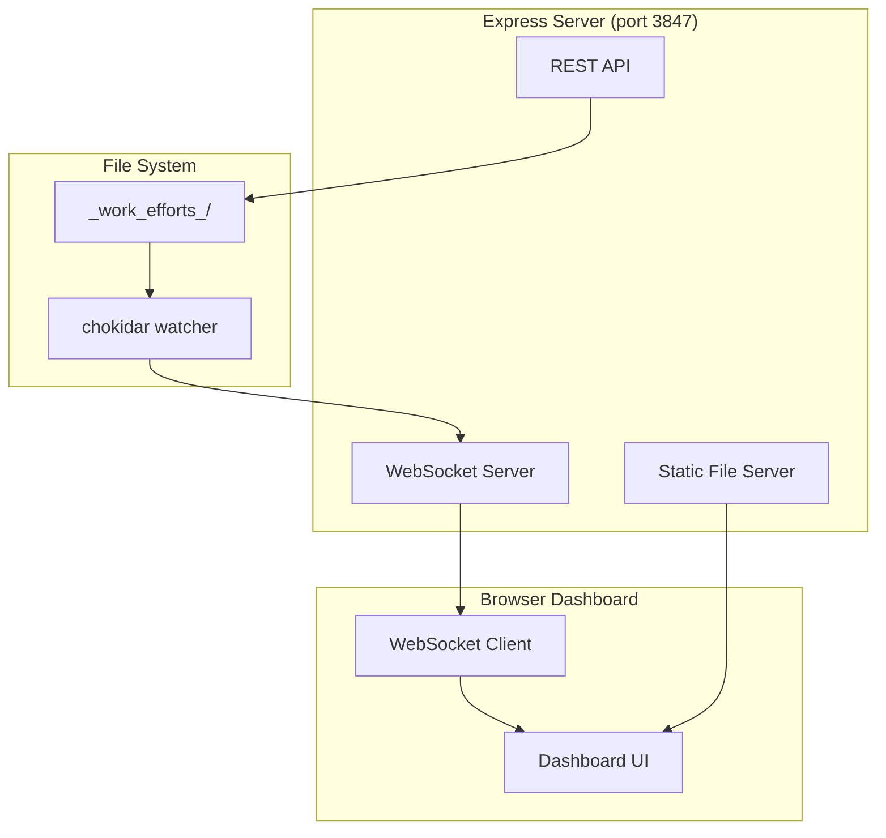

# Work Efforts Mission Control Dashboard

## Architecture



## File Structure

```
mcp-servers/dashboard/
├── server.js          # Express + WebSocket + file watcher
├── package.json       # Dependencies
├── public/
│   ├── index.html     # Dashboard HTML
│   ├── styles.css     # Fogsift-themed styles
│   └── app.js         # Client-side JS
└── README.md          # Usage docs
```

## Key Implementation Details

### Server ([`mcp-servers/dashboard/server.js`](mcp-servers/dashboard/server.js))
- Express serves static files from `public/`
- `chokidar` watches `_work_efforts_/` for changes
- `ws` WebSocket broadcasts updates to connected clients
- REST endpoint `GET /api/work-efforts` returns parsed WE/ticket data
- Reuses parsing logic pattern from existing [`mcp-servers/work-efforts/server.js`](mcp-servers/work-efforts/server.js)

### Dashboard UI
- Dark theme matching fogsift tokens (bg: `#1a1412`, accent: `#fb923c`)
- ASCII-style card borders using CSS `border-style: double` or box-drawing characters
- JetBrains Mono for data display
- Status badges with semantic colors (active=orange, completed=green, blocked=red)
- Expandable WE cards showing nested tickets

### Real-time Updates
- WebSocket connection auto-reconnects
- File changes trigger full re-scan and broadcast
- UI updates without page refresh

## Dependencies

```json
{
  "express": "^4.18.2",
  "ws": "^8.14.2", 
  "chokidar": "^3.5.3"
}
```

## Commands

```bash
cd mcp-servers/dashboard && npm install
node server.js  # Starts on http://localhost:3847
```

Port 3847 chosen as memorable (looks like "DART" - dashboard art).
