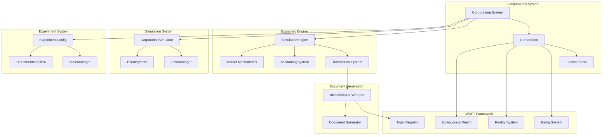
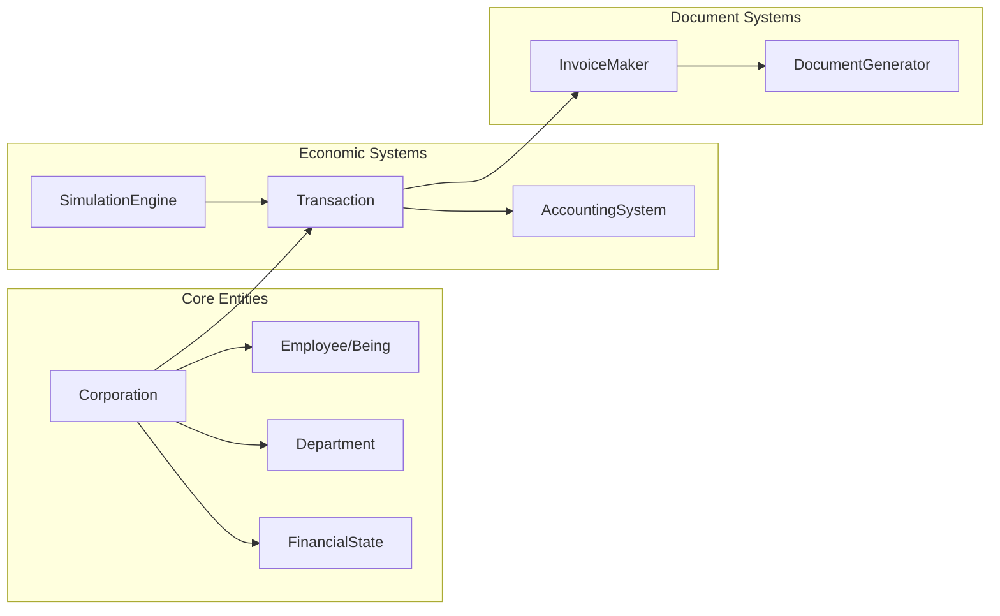
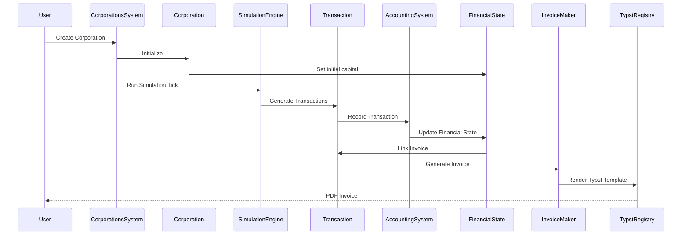

# Teleport Massive Economic Simulation System
## Architecture & Technical Stack Requirements

**Date**: 2026-01-19  
**Version**: 1.0.0  
**Status**: Architecture Specification

---

## Table of Contents

1. [Executive Summary](#executive-summary)
2. [System Architecture](#system-architecture)
3. [Technical Stack](#technical-stack)
4. [Component Specifications](#component-specifications)
5. [Data Models](#data-models)
6. [Integration Architecture](#integration-architecture)
7. [Economic Model](#economic-model)
8. [Performance Requirements](#performance-requirements)
9. [Security & Permissions](#security--permissions)
10. [Testing Strategy](#testing-strategy)
11. [Deployment & Operations](#deployment--operations)

---

## Executive Summary

### System Overview

The Teleport Massive Economic Simulation System is a comprehensive economic modeling framework that simulates corporate entities from founding through growth. It models real economic transactions, tracks financial state using double-entry accounting, and generates professional Typst-based documentation for all corporate activities.

### Key Architectural Decisions

1. **WAFT-Native Implementation**: Built entirely within WAFT framework, using existing systems (Beings, Realities, Typst)
2. **Pattern-Based Design**: Adopts concepts from economic simulation libraries without direct dependencies
3. **File-Based Persistence**: JSON/YAML configuration and state files for repeatable experiments
4. **Typst Document Generation**: All corporate documents (invoices, reports, CVs) generated via Typst templates
5. **Being System Integration**: All employees are WAFT Beings with lifecycle attributes
6. **Double-Entry Accounting**: Proper accounting principles for financial accuracy

### Purpose & Scope

- **Purpose**: Model Teleport Massive Corporation from 2025 founding through growth
- **Scope**: Economic simulation, financial tracking, document generation, repeatable experiments
- **Integration**: Being system, Reality system, Typst templates, Bureaucracy realm

---

## System Architecture

### High-Level Architecture



### Component Relationships



### Data Flow



---

## Technical Stack

### Core Technologies

#### Python 3.10+

**Requirements:**
- Python 3.10 or higher
- Type hints throughout
- Dataclasses for data models
- Async/await support for simulation cycles
- `decimal.Decimal` for financial calculations (no float for money)

**Key Standard Library Modules:**
- `pathlib.Path` - File system operations
- `json` - Data serialization
- `datetime` - Time management
- `decimal.Decimal` - Financial precision
- `typing` - Type system
- `enum.Enum` - Transaction types, states
- `asyncio` - Async simulation cycles
- `dataclasses` - Data models

#### Typst

**Template System:**
- Typst compiler required
- Template: `@preview/invoice-maker:1.1.0`
- Document generation pipeline
- PDF output format

**Integration:**
- TypstTemplateRegistry for template discovery
- Wrapper pattern for template invocation
- Automatic PDF generation

### WAFT Dependencies

#### Being System (`src/waft/being.py`)

**Integration Points:**
- Employees are WAFT Beings
- Being lifecycle attributes (will_to_live, luck, decision_fatigue)
- Being skills and memories
- Being personality and goals

**Usage:**
```python
from waft.being import BeingSystem, Being

# Employee is a Being
employee: Being = being_system.get_being(being_id)
```

#### Reality System (`src/waft/reality.py`)

**Integration Points:**
- Corporate realities for each corporation
- Reality types (CUSTOM for corporations)
- Realm structure integration

**Usage:**
```python
from waft.reality import RealitySystem, RealityType

# Create corporate reality
reality = reality_system.create_reality(
    RealityType.CUSTOM,
    {"corp_id": corp_id, "type": "corporation"}
)
```

#### Typst Template Registry (`src/waft/templates/typst/registry.py`)

**Integration Points:**
- Template discovery and registration
- Wrapper pattern for template invocation
- Metadata management

**Usage:**
```python
from waft.templates.typst import get_typst_registry

registry = get_typst_registry()
template = registry.get_template("invoice_maker")
```

#### Bureaucracy Realm (`src/waft/core/bureaucracy_realm.py`)

**Integration Points:**
- Corporate file structure
- Personnel file management
- Path validation and security

**Usage:**
```python
from waft.core.bureaucracy_realm import BureaucracyRealm

realm = BureaucracyRealm(project_path)
# Corporate files stored in _realms/bureaucracy_realm/corporations/
```

#### NowCycleManager (`src/waft/core/now_cycle.py`)

**Integration Points:**
- Being lifecycle events
- Cycle-based simulation coordination
- State synchronization

**Usage:**
```python
from waft.core.now_cycle import NowCycleManager

# Coordinate with Being lifecycle
cycle_manager = NowCycleManager(project_path, being_system)
await cycle_manager.execute_cycle()
```

### External Library Patterns (Conceptual)

**Note**: These are pattern references, NOT direct dependencies. Concepts are adapted to WAFT architecture.

#### ESL (Economic Simulation Library) - Patterns Only

**Concepts Adopted:**
- Agent-based modeling patterns
- Market mechanism abstractions
- Transaction messaging framework
- Economic agent interactions

**Implementation:**
- WAFT-native agent-based modeling using Beings
- Market mechanisms in `market.py`
- Transaction system with messaging patterns

#### eno-world-simulation - Patterns Only

**Concepts Adopted:**
- Hierarchical structure (individuals → buildings → cities)
- Need systems (map to corporate needs)
- Time-based simulation (tick system)

**Implementation:**
- Hierarchy: Employees → Departments → Corporations
- Corporate needs: Financial health, research progress, market position
- Tick-based economic cycles

#### pareto-distribution-simulation - Patterns Only

**Concepts Adopted:**
- Economic distribution modeling
- Personality-based economic behavior
- Wealth/salary distribution patterns

**Implementation:**
- Salary distribution modeling
- Personality traits affecting economic decisions
- Wealth accumulation patterns

#### nash - Patterns Only

**Concepts Adopted:**
- Game theory for strategic decisions
- Nash equilibrium in contracts/negotiations
- Agent decision-making under incentives

**Implementation:**
- Strategic decision modeling
- Contract negotiations
- Incentive alignment

### Development Tools

#### Type Checking
- **mypy** or **pyright** for static type checking
- Type hints required for all public APIs
- Strict type checking for financial calculations

#### Testing Framework
- **pytest** for unit and integration tests
- Test coverage for financial calculations
- Simulation repeatability tests

#### Code Formatting
- **black** for code formatting
- **ruff** for linting
- Consistent style across codebase

#### Documentation
- Docstrings for all classes and methods
- Type hints in function signatures
- Architecture documentation (this document)

---

## Component Specifications

### CorporationsSystem

**Location**: `src/waft/core/corporations/corporations_system.py`

**Responsibilities:**
- Manage multiple corporations
- Coordinate economic simulations
- Integrate with Being system
- Manage Typst document generation
- Handle experiment configurations

**Public API:**

```python
class CorporationsSystem:
    def __init__(project_path: Optional[Path] = None)
    
    def create_corporation(
        name: str,
        sector: str = "",
        mission: str = "",
        founded_date: Optional[datetime] = None,
        initial_capital: Optional[Decimal] = None,
        corp_id: Optional[str] = None
    ) -> Corporation
    
    def get_corporation(corp_id: str) -> Optional[Corporation]
    
    def list_corporations() -> List[Corporation]
    
    def run_simulation(
        corp_id: str,
        ticks: int,
        tick_frequency: str = "daily"
    ) -> SimulationResult
```

**Dependencies:**
- `Corporation` entity
- `BeingSystem` for employees
- `RealitySystem` for corporate realities
- `TypstTemplateRegistry` for document generation

**State Management:**
- In-memory registry of loaded corporations
- File-based persistence via manifests
- System manifest at `_realms/bureaucracy_realm/corporations/system_manifest.json`

### Corporation Entity

**Location**: `src/waft/core/corporations/corporation.py`

**Attributes:**
- `corp_id: str` - Unique identifier
- `name: str` - Corporation name
- `founded_date: datetime` - Founding date
- `sector: str` - Industry sector
- `mission: str` - Mission statement
- `financial_state: FinancialState` - Financial tracking
- `departments: Dict[str, Department]` - Organizational structure
- `employees: Dict[str, Employee]` - Employee roster (being_id -> Employee)
- `project_path: Path` - Project root path

**Lifecycle:**
1. **Creation**: Initialize with founding date and initial capital
2. **Growth**: Add departments, hire employees (Beings)
3. **Operations**: Process transactions, run simulations
4. **Reporting**: Generate financial statements, invoices

**Relationships:**
- **Employees**: Each employee is a WAFT Being
- **Departments**: Organizational units containing employees
- **Financial State**: Tracks all financial metrics
- **Transactions**: Economic events affecting financial state

**Persistence:**
- Corporate manifest: `_realms/bureaucracy_realm/corporations/{corp_id}/corporate_manifest.json`
- Financial records: `_realms/bureaucracy_realm/corporations/{corp_id}/financials/`
- Invoices: `_realms/bureaucracy_realm/corporations/{corp_id}/invoices/`

### FinancialState

**Location**: `src/waft/core/corporations/financial_state.py`

**Financial Model:**
- **Cash**: Liquid assets (Decimal)
- **Assets**: Non-cash assets (Dict[str, Decimal])
- **Liabilities**: Debts and obligations (Dict[str, Decimal])
- **Equity**: Owner's equity (calculated: assets - liabilities)
- **Revenue**: Total income (Decimal)
- **Expenses**: Total costs (Decimal)

**Key Methods:**

```python
class FinancialState:
    def update_cash(amount: Decimal, description: str) -> None
    def add_asset(asset_type: str, value: Decimal, description: str) -> None
    def add_liability(liability_type: str, value: Decimal, description: str) -> None
    def record_revenue(amount: Decimal, description: str) -> None
    def record_expense(amount: Decimal, description: str) -> None
    def get_burn_rate(period_days: int = 30) -> Decimal
    def get_runway_months() -> Optional[Decimal]
    def get_net_income() -> Decimal
```

**Accounting Principles:**
- Double-entry accounting via `AccountingSystem`
- Transaction history tracking
- Automatic equity recalculation
- Burn rate and runway calculations

### Transaction System

**Location**: `src/waft/core/corporations/economics/transaction.py`

**Transaction Types:**
- `SALARY` - Salary payment to employee
- `VENDOR_INVOICE` - Invoice from vendor (expense)
- `CUSTOMER_INVOICE` - Invoice to customer (revenue)
- `INVESTMENT` - Capital investment
- `EXPENSE` - General expense
- `REVENUE` - General revenue
- `ASSET_PURCHASE` - Purchase of asset
- `LOAN` - Loan received or paid

**Transaction Structure:**

```python
class Transaction:
    transaction_id: str
    transaction_type: TransactionType
    amount: Decimal
    description: str
    from_party: Optional[str]  # For expenses, salaries
    to_party: Optional[str]    # For revenue, investments
    timestamp: datetime
    metadata: Dict[str, Any]
    invoice_id: Optional[str]  # Link to generated invoice
    invoice_path: Optional[str]  # Path to invoice PDF
```

**Double-Entry Accounting:**
- `get_accounting_entries()` returns debit/credit entries
- Positive = debit, Negative = credit
- Automatic account mapping

### AccountingSystem

**Location**: `src/waft/core/corporations/economics/accounting.py`

**Responsibilities:**
- Maintain transaction ledger
- Track account balances
- Generate financial statements
- Persist ledger to disk

**Account Structure:**
- `cash` - Cash account
- `revenue` - Revenue account (credit balance)
- `expenses` - Expenses account (debit balance)
- `equity` - Equity account
- Additional accounts as needed

**Ledger Persistence:**
- Path: `_realms/bureaucracy_realm/corporations/{corp_id}/financials/ledger.json`
- Format: JSON with transactions and account balances
- Auto-save on each transaction

### SimulationEngine

**Location**: `src/waft/core/corporations/economics/simulation_engine.py`

**Responsibilities:**
- Execute tick-based economic simulation
- Process economic cycles (daily/weekly/monthly)
- Generate economic events
- Update financial state
- Trigger document generation

**Simulation Flow:**

```python
class SimulationEngine:
    async def tick() -> Dict[str, Any]:
        # 1. Process payroll
        # 2. Process invoices
        # 3. Update financial state
        # 4. Generate documents
        # 5. Return state changes
```

**Economic Cycles:**
- **Daily**: Process transactions, update balances
- **Weekly**: Generate invoices, process payroll
- **Monthly**: Financial statements, reports
- **Quarterly**: Investor reports, strategic planning

### Typst Invoice Integration

**Location**: `src/waft/templates/typst/wrappers/invoice_maker.py`

**Template**: `@preview/invoice-maker:1.1.0`

**Wrapper Pattern:**

```python
def generate_invoice(
    transaction: Transaction,
    corporation: Corporation,
    output_path: Path
) -> Path:
    # Map transaction to invoice template parameters
    # Generate Typst source
    # Compile to PDF
    # Return PDF path
```

**Invoice Types:**
- Vendor invoices (equipment, services)
- Customer invoices (revenue)
- Salary payment records
- Expense documentation

**Integration:**
- Auto-registered in TypstTemplateRegistry
- Linked to transactions via `invoice_id` and `invoice_path`
- Generated automatically for all transactions

---

## Data Models

### Corporation Data Model

**JSON Schema:**

```json
{
  "corp_id": "string",
  "name": "string",
  "founded": "ISO8601 datetime",
  "sector": "string",
  "mission": "string",
  "departments": [
    {
      "name": "string",
      "department_id": "string",
      "created_at": "ISO8601 datetime",
      "employees": ["being_id"]
    }
  ],
  "employees": [
    {
      "being_id": "string",
      "role": "string",
      "department": "string",
      "title": "string",
      "level": "integer",
      "salary": "decimal",
      "hired_at": "ISO8601 datetime",
      "status": "active|inactive|terminated"
    }
  ],
  "financial_state": {
    "cash": "decimal",
    "assets": {"asset_type": "decimal"},
    "liabilities": {"liability_type": "decimal"},
    "equity": "decimal",
    "revenue": "decimal",
    "expenses": "decimal"
  }
}
```

### Transaction Data Model

**JSON Schema:**

```json
{
  "transaction_id": "string",
  "transaction_type": "salary|vendor_invoice|customer_invoice|investment|expense|revenue|asset_purchase|loan",
  "amount": "decimal",
  "description": "string",
  "from_party": "string|null",
  "to_party": "string|null",
  "timestamp": "ISO8601 datetime",
  "metadata": {},
  "invoice_id": "string|null",
  "invoice_path": "string|null"
}
```

### Experiment Configuration Model

**JSON Schema:**

```json
{
  "experiment_id": "string",
  "version": "semver",
  "description": "string",
  "created_at": "ISO8601 datetime",
  "initial_conditions": {
    "corporation": {
      "name": "string",
      "founded": "ISO8601 datetime",
      "initial_capital": "decimal",
      "sector": "string"
    },
    "founders": [
      {
        "being_id": "string",
        "role": "string",
        "salary": "decimal"
      }
    ],
    "employees": [
      {
        "being_id": "string",
        "role": "string",
        "salary": "decimal"
      }
    ],
    "financials": {
      "cash": "decimal",
      "monthly_burn_rate": "decimal",
      "revenue": "decimal"
    }
  },
  "simulation_parameters": {
    "tick_frequency": "daily|weekly|monthly",
    "start_date": "ISO8601 datetime",
    "end_date": "ISO8601 datetime|null"
  }
}
```

### Financial State Model

**JSON Schema:**

```json
{
  "cash": "decimal",
  "assets": {"asset_type": "decimal"},
  "liabilities": {"liability_type": "decimal"},
  "equity": "decimal",
  "revenue": "decimal",
  "expenses": "decimal",
  "net_income": "decimal",
  "total_assets": "decimal",
  "total_liabilities": "decimal",
  "burn_rate": "decimal",
  "runway_months": "decimal|null",
  "last_updated": "ISO8601 datetime",
  "transaction_count": "integer"
}
```

---

## Integration Architecture

### Being System Integration

**Employee as Being:**

```python
# Employee is a WAFT Being
employee_being: Being = being_system.get_being(being_id)

# Access Being attributes
employee_being.skills  # Skills relevant to role
employee_being.personality  # Affects economic decisions
employee_being.will_to_live  # Lifecycle attribute
employee_being.luck  # Affects outcomes
```

**Integration Points:**
- Employees are Beings with corporate roles
- Being skills map to job performance
- Being personality affects economic behavior
- Being lifecycle events (death, reincarnation) affect corporation

**Lifecycle Coordination:**
- NowCycleManager coordinates Being lifecycle
- Corporate simulation ticks can align with Being cycles
- Being death triggers employee termination

### Reality System Integration

**Corporate Realities:**

```python
# Each corporation has a reality
reality = reality_system.create_reality(
    RealityType.CUSTOM,
    {
        "corp_id": corp_id,
        "type": "corporation",
        "name": corporation.name
    }
)
```

**Reality Structure:**
- Corporate reality contains all corporate entities
- Departments as sub-realities (optional)
- Employees spawn into corporate reality
- Corporate events recorded in reality

### Typst Template System Integration

**Template Discovery:**

```python
from waft.templates.typst import get_typst_registry

registry = get_typst_registry()
invoice_template = registry.get_template("invoice_maker")
```

**Document Generation Pipeline:**

1. Transaction created
2. Transaction linked to invoice generation
3. InvoiceMaker wrapper invoked
4. Typst template rendered
5. PDF generated
6. Invoice path stored in transaction

**Template Registry:**
- Auto-discovery of wrapper modules
- Metadata extraction from docstrings
- Category and tag organization
- Version tracking

### File System Integration

**Directory Structure:**

```
_realms/bureaucracy_realm/corporations/
├── system_manifest.json
└── {corp_id}/
    ├── corporate_manifest.json
    ├── financials/
    │   ├── ledger.json
    │   ├── balance_sheets/
    │   ├── income_statements/
    │   └── cash_flow/
    ├── invoices/
    │   ├── incoming/  # Customer invoices
    │   ├── outgoing/  # Vendor invoices
    │   └── payroll/   # Salary records
    └── experiments/
        └── {experiment_id}_config.json
```

**File Naming Conventions:**
- Invoices: `INV-{YYYY}-{NNN}.pdf`
- Financial statements: `{statement_type}_{YYYY-MM-DD}.pdf`
- Experiment configs: `{experiment_id}_config.json`

**Permissions:**
- Directory permissions: `0o700` (owner read/write/execute only)
- File permissions: `0o600` (owner read/write only)
- Path validation for all operations

---

## Economic Model

### Starting Conditions (Teleport Massive, 2025)

**Founding Parameters:**
- **Founding Date**: July 1, 2025
- **Initial Capital**: $2,000,000 (seed funding)
- **Founders**: 2-3 Beings (quantum physicists, entrepreneurs)
- **Monthly Burn Rate**: ~$150,000
  - Salaries: $80,000/month
  - Equipment: $40,000/month
  - Rent/Operations: $30,000/month
- **Revenue**: $0 initially (research phase)
- **Runway**: ~13 months at current burn rate

### Economic Cycles

**Daily Cycle:**
- Process transactions
- Update account balances
- Check cash flow
- Generate daily reports

**Weekly Cycle:**
- Process payroll
- Generate vendor invoices
- Process customer invoices
- Update financial state

**Monthly Cycle:**
- Generate financial statements
- Calculate burn rate
- Update runway projections
- Generate monthly reports

**Quarterly Cycle:**
- Investor reports
- Strategic planning
- Budget reviews
- Performance analysis

### Transaction Types & Flow

**Salary Payments:**
```
Corporation → Employee (Being)
Type: SALARY
Effect: Decrease cash, increase expenses
Document: Salary payment record (PDF)
```

**Vendor Invoices:**
```
Vendor → Corporation
Type: VENDOR_INVOICE
Effect: Decrease cash, increase expenses
Document: Vendor invoice (PDF)
```

**Customer Invoices:**
```
Corporation → Customer
Type: CUSTOMER_INVOICE
Effect: Increase cash, increase revenue
Document: Customer invoice (PDF)
```

**Investments:**
```
Investor → Corporation
Type: INVESTMENT
Effect: Increase cash, increase equity
Document: Investment record (PDF)
```

### Financial Calculations

**Burn Rate:**
```python
burn_rate = sum(recent_expenses) * (30 / period_days)
```

**Runway:**
```python
runway_months = cash / burn_rate  # If burn_rate > 0
```

**Net Income:**
```python
net_income = revenue - expenses
```

**Equity:**
```python
equity = total_assets - total_liabilities
```

---

## Performance Requirements

### Scalability Targets

**Multiple Corporations:**
- Support 10+ corporations simultaneously
- Independent simulation per corporation
- Shared Being system across corporations

**Large Employee Counts:**
- Support 100+ employees per corporation
- Efficient Being lookup and updates
- Batch processing for payroll

**Transaction Volume:**
- Handle 1000+ transactions per simulation
- Efficient ledger storage and retrieval
- Fast financial state updates

**Document Generation:**
- Generate 100+ invoices per simulation
- Parallel Typst compilation (if supported)
- Efficient file I/O

### Performance Targets

**Simulation Tick Time:**
- Daily tick: < 1 second for 50 employees
- Weekly tick: < 5 seconds for 50 employees
- Monthly tick: < 10 seconds for 50 employees

**Document Generation Time:**
- Invoice generation: < 2 seconds per invoice
- Financial statement: < 5 seconds
- Batch generation: Parallel processing

**State Save/Load Time:**
- Save state: < 1 second
- Load state: < 2 seconds
- Experiment config load: < 500ms

**Query Performance:**
- Get corporation: < 100ms
- List corporations: < 500ms
- Financial state query: < 100ms

### Optimization Strategies

1. **Lazy Loading**: Load corporations on demand
2. **Caching**: Cache Being lookups
3. **Batch Operations**: Batch transaction processing
4. **Async Processing**: Async simulation cycles
5. **Incremental Updates**: Update only changed state

---

## Security & Permissions

### File System Security

**Directory Permissions:**
- Corporate directories: `0o700` (owner read/write/execute only)
- Financial directories: `0o700`
- Invoice directories: `0o700`

**File Permissions:**
- Manifest files: `0o600` (owner read/write only)
- Financial records: `0o600`
- Invoice PDFs: `0o600`
- Experiment configs: `0o600`

**Path Validation:**
- All file operations validate paths
- Prevent directory traversal attacks
- Validate realm paths via `validate_realm_path()`

### Data Validation

**Input Validation:**
- Validate all financial amounts (positive, reasonable)
- Validate dates (not future for historical data)
- Validate Being IDs (exist in Being system)
- Validate transaction types (enum values)

**Financial Calculations:**
- Use `Decimal` for all financial calculations
- Never use `float` for money
- Validate balance consistency
- Check for negative cash (warnings)

**State Consistency:**
- Verify equity = assets - liabilities
- Verify cash balance matches transactions
- Verify transaction ledger consistency
- Validate experiment configs before loading

---

## Testing Strategy

### Unit Testing

**Component Tests:**
- `CorporationsSystem`: Create, get, list corporations
- `Corporation`: Add employees, departments, transactions
- `FinancialState`: Update cash, assets, liabilities, calculate metrics
- `Transaction`: Create transactions, get accounting entries
- `AccountingSystem`: Record transactions, calculate balances

**Financial Calculation Tests:**
- Burn rate calculations
- Runway calculations
- Equity calculations
- Net income calculations
- Double-entry accounting accuracy

**State Management Tests:**
- Save/load corporation state
- Save/load financial state
- Save/load experiment configs
- State persistence consistency

### Integration Testing

**System Integration:**
- Corporation creation with Being system
- Employee hiring (Being integration)
- Transaction processing with accounting
- Document generation with Typst

**Being System Integration:**
- Employee as Being
- Being lifecycle events
- Being skills and personality
- Being death handling

**Typst Integration:**
- Invoice generation
- Template discovery
- PDF output validation
- Document linking

### Simulation Testing

**Economic Model Validation:**
- Starting conditions accuracy
- Transaction flow correctness
- Financial state updates
- Burn rate accuracy

**Repeatability Verification:**
- Same config produces same results
- State save/load preserves simulation
- Experiment configs are deterministic

**State Persistence:**
- State survives restarts
- Configs can be reloaded
- Financial state consistency
- Transaction history preservation

---

## Deployment & Operations

### File System Requirements

**Directory Structure:**
- `_realms/bureaucracy_realm/corporations/` must exist
- Subdirectories created automatically
- Permissions set automatically

**Storage Requirements:**
- ~1KB per corporation manifest
- ~10KB per financial ledger
- ~100KB per invoice PDF
- ~1MB per experiment config (with full state)

**Estimated Storage:**
- 10 corporations: ~10MB
- 1000 transactions: ~1MB
- 100 invoices: ~10MB
- Total: ~25MB for small-scale simulation

### Runtime Requirements

**Python Version:**
- Python 3.10 or higher
- Type hints support
- Async/await support
- Decimal precision

**Typst Installation:**
- Typst compiler installed
- Template `@preview/invoice-maker:1.1.0` available
- PDF generation capability

**Dependencies:**
- WAFT framework (Being system, Reality system, Typst registry)
- Standard library only (no external dependencies for core system)

### Operational Procedures

**Creating a Corporation:**
1. Initialize CorporationsSystem
2. Create corporation with initial capital
3. Hire founders (create Beings)
4. Set up departments
5. Begin simulation

**Running a Simulation:**
1. Load experiment config (optional)
2. Initialize simulation engine
3. Run simulation ticks
4. Generate documents
5. Save state (optional)

**Loading an Experiment:**
1. Load experiment config JSON
2. Recreate corporation from config
3. Restore financial state
4. Restore employees (Beings)
5. Resume simulation

---

## Future Considerations

### Scalability Enhancements

**Database Migration:**
- Consider SQLite for larger simulations
- Indexed queries for performance
- Transaction history archival

**Distributed Simulation:**
- Multi-corporation parallel simulation
- Shared market mechanisms
- Cross-corporation interactions

**Performance Optimization:**
- Caching strategies
- Lazy loading optimizations
- Batch processing improvements

### Feature Extensions

**Multi-Corporation Interactions:**
- Market competition
- Supply chain relationships
- Mergers and acquisitions

**Market Dynamics:**
- Supply and demand modeling
- Price discovery mechanisms
- Market events and shocks

**Advanced Economic Models:**
- Game theory integration
- Strategic decision modeling
- Behavioral economics

---

## Appendix

### File Structure Reference

```
src/waft/core/corporations/
├── __init__.py
├── corporations_system.py
├── corporation.py
├── financial_state.py
├── economics/
│   ├── __init__.py
│   ├── simulation_engine.py
│   ├── transaction.py
│   ├── accounting.py
│   ├── market.py
│   └── library_integration.py
├── simulation/
│   ├── __init__.py
│   ├── corporation_simulator.py
│   ├── time_manager.py
│   └── event_system.py
├── experiments/
│   ├── __init__.py
│   ├── experiment_config.py
│   ├── state_manager.py
│   └── experiment_manifest.py
└── teleport_massive/
    ├── __init__.py
    ├── founding_story.py
    └── initial_conditions.py

src/waft/templates/typst/wrappers/
└── invoice_maker.py
```

### Key Design Patterns

1. **Wrapper Pattern**: Typst template wrappers for document generation
2. **Registry Pattern**: Template and corporation registries
3. **Factory Pattern**: Corporation and transaction creation
4. **Observer Pattern**: State change notifications (future)
5. **Strategy Pattern**: Economic simulation strategies (future)

### Glossary

- **Being**: WAFT entity with lifecycle, skills, and personality
- **Corporation**: Economic entity with financial state and employees
- **Transaction**: Economic event affecting financial state
- **Tick**: Single simulation cycle (daily/weekly/monthly)
- **Burn Rate**: Monthly cash expenditure rate
- **Runway**: Months until cash runs out
- **Equity**: Assets minus liabilities
- **Double-Entry**: Accounting method with debits and credits

---

**Document Status**: Architecture Specification v1.0.0  
**Last Updated**: 2026-01-19  
**Next Review**: After Phase 1 implementation
