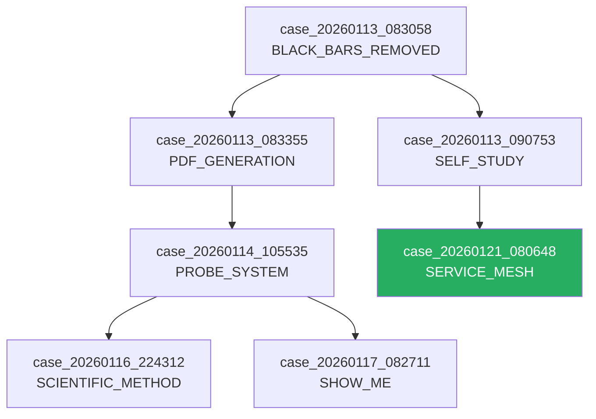

# Case File Evolution: Living Proof Artifacts

> **Vision**: Transform Case Files from static proof documents into living, queryable artifacts that actively participate in WAFT's evolutionary ecosystem.

**Work Effort**: WE-260121-oxzc
**Date**: 2026-01-21
**Status**: Design Phase

---

## Executive Summary

The current Case File system produces valuable proof documents, but they exist as **isolated artifacts**. This design evolves them into **first-class citizens** of the WAFT ecosystem that:

1. **Feed the Flight Recorder** - Every case is an evolutionary event
2. **Integrate with Empirica** - Track epistemic claims over time
3. **Connect to Realms/Beings** - Cross-reference the gamified mesh
4. **Enable Machine Learning** - Queryable knowledge for AI retrieval
5. **Calibrate Confidence** - Track prediction accuracy over generations
6. **Auto-Validate** - Re-run evidence tests periodically
7. **Version Claims** - Track how understanding evolves

---

## Part 1: Machine-Readable Schema

### Current State

```typst
// Case Brief Metadata
#let case-id = "case_20260121_080648_gamified_service_mesh"
#let case-date = "2026-01-21 08:06:48 PST"
#let claim = "Successfully pivoted..."
#let verdict = "PROVEN"
#let confidence = "95%"
```

**Problem**: Metadata is embedded in Typst variables - not easily parseable by external systems.

### Evolved State: YAML Frontmatter + Typst Body

```yaml
---
# Case File Schema v2.0
case:
  id: case_20260121_080648_gamified_service_mesh
  type: implementation_proof  # proof, critique, analysis, retrospective
  version: 1
  created: 2026-01-21T08:06:48-08:00
  updated: 2026-01-21T08:52:00-08:00

claim:
  statement: "Successfully pivoted from simple CLI tool to Gamified Service Mesh architecture"
  domain: architecture
  scope: system-wide
  
verdict:
  status: PROVEN  # PROVEN, DISPROVEN, INCONCLUSIVE, PENDING
  confidence: 0.95
  evidence_quality: high  # low, medium, high, definitive
  
evidence:
  files:
    - path: src/waft/core/realms/server.py
      lines: [19, 206]
      type: implementation
      finding: "RealmServer class manages PocketBase instances"
    - path: src/waft/core/inventory/client.py
      lines: [1, 240]
      type: implementation
      finding: "HTTP REST client replaces file I/O"
  tests:
    - name: realm_port_assignment
      status: passed
      last_run: 2026-01-21T08:00:00-08:00
    - name: bootstrap_authentication
      status: passed
      last_run: 2026-01-21T08:05:00-08:00

links:
  parent_cases: []  # Cases this builds upon
  child_cases: []   # Cases that build upon this
  related_cases:
    - case_20260120_224053_teleport_massive_autoplay
  work_efforts:
    - WE-260121-oxzc
  realms:
    - daily_learning_realm
  beings:
    - packrat_being

flight_recorder:
  event_type: CASE_PROVEN
  genome_id: null  # Linked agent genome if applicable
  generation: null
  
empirica:
  session_id: null  # Active Empirica session
  preflight_vectors: null
  postflight_vectors: null
  learning_delta: null

calibration:
  prediction_made: 2026-01-21T08:06:48-08:00
  predicted_confidence: 0.95
  actual_outcome: null  # Filled when claim is validated in production
  calibration_score: null  # How accurate was our confidence?

tags:
  - service-mesh
  - pocketbase
  - architecture-pivot
  - gamification
---
```

### Benefits

1. **Parseable** - Any language can read YAML frontmatter
2. **Searchable** - Index on any field
3. **Versionable** - Track schema evolution
4. **Linkable** - Rich cross-references
5. **Validatable** - JSON Schema for correctness

---

## Part 2: Case Registry & Indexing

### Architecture

```
_work_efforts/
└── proof_cases/
    ├── .registry/
    │   ├── index.json          # All cases indexed
    │   ├── by_verdict.json     # Grouped by outcome
    │   ├── by_domain.json      # Grouped by domain
    │   ├── graph.json          # Dependency graph
    │   └── calibration.json    # Prediction accuracy
    ├── case_20260121_*.typ
    └── case_20260121_*.md
```

### Index Schema

```json
{
  "version": "2.0",
  "updated": "2026-01-21T08:52:00-08:00",
  "total_cases": 127,
  "statistics": {
    "proven": 89,
    "disproven": 12,
    "inconclusive": 18,
    "pending": 8
  },
  "calibration": {
    "mean_confidence": 0.78,
    "actual_accuracy": 0.82,
    "calibration_error": 0.04
  },
  "cases": [
    {
      "id": "case_20260121_080648_gamified_service_mesh",
      "claim": "Successfully pivoted...",
      "verdict": "PROVEN",
      "confidence": 0.95,
      "domain": "architecture",
      "created": "2026-01-21T08:06:48-08:00",
      "file": "case_20260121_080648_gamified_service_mesh.typ"
    }
  ]
}
```

### CLI Commands

```bash
# List all cases
waft cases list

# Search cases
waft cases search "service mesh"
waft cases search --domain architecture --verdict PROVEN

# Show case details
waft cases show case_20260121_080648

# Generate registry index
waft cases reindex

# View calibration report
waft cases calibration
```

---

## Part 3: Flight Recorder Integration

### Concept

Every Case File is an **evolutionary event** in the Flight Recorder. When a case is created or updated, it's logged as part of WAFT's phylogenetic tree.

### Event Types

```python
class CaseEventType(Enum):
    CASE_CREATED = "case_created"
    CASE_PROVEN = "case_proven"
    CASE_DISPROVEN = "case_disproven"
    CASE_INCONCLUSIVE = "case_inconclusive"
    CASE_REVISED = "case_revised"  # Confidence changed
    CASE_VALIDATED = "case_validated"  # Production confirmation
    CASE_INVALIDATED = "case_invalidated"  # Production failure
```

### Flight Recorder Entry

```json
{
  "timestamp": "2026-01-21T08:06:48-08:00",
  "event_type": "CASE_PROVEN",
  "case_id": "case_20260121_080648_gamified_service_mesh",
  "genome_id": "sha256:abc123...",  // If linked to agent
  "parent_id": null,
  "generation": 47,
  "payload": {
    "claim": "Successfully pivoted...",
    "confidence": 0.95,
    "evidence_count": 10,
    "files_modified": 7
  },
  "context": {
    "work_effort": "WE-260121-oxzc",
    "session_id": "empirica-session-xyz"
  }
}
```

### Phylogenetic Analysis

Cases form their own **evolutionary tree**:

```
case_20260113_083058 (BLACK_BARS_REMOVED)
├── case_20260113_083355 (PDF_GENERATION_IMPROVED)
│   └── case_20260114_105535 (PROBE_SYSTEM_VALIDATED)
│       ├── case_20260116_224312 (SCIENTIFIC_METHOD_TOOL)
│       └── case_20260117_082711 (SHOW_ME_ENHANCED)
└── case_20260113_090753 (SELF_STUDY_ENABLED)
    └── case_20260121_080648 (GAMIFIED_SERVICE_MESH) ← Current
```

---

## Part 4: Empirica Integration

### Epistemic Tracking

Every case represents a **knowledge claim**. Empirica tracks:

1. **Preflight** - What did we know before investigation?
2. **Postflight** - What do we know after?
3. **Delta** - How much did we learn?

### CASCADE Workflow for Cases

```
PREFLIGHT
├── Know: 0.6 (Suspected architecture would work)
├── Do: 0.7 (Had implementation plan)
├── Context: 0.5 (Needed to verify components)
└── Uncertainty: 0.4

INVESTIGATION → Case File Generated

POSTFLIGHT
├── Know: 0.95 (Architecture proven)
├── Do: 0.9 (Implementation complete)
├── Context: 0.85 (All components verified)
└── Uncertainty: 0.1

DELTA (Learning)
├── Know: +0.35
├── Do: +0.2
├── Context: +0.35
└── Uncertainty: -0.3
```

### Case-Empirica Link

```yaml
empirica:
  session_id: emp-2026-01-21-abcd
  preflight:
    engagement: 0.8
    foundation:
      know: 0.6
      do: 0.7
      context: 0.5
    uncertainty: 0.4
  postflight:
    engagement: 0.95
    foundation:
      know: 0.95
      do: 0.9
      context: 0.85
    uncertainty: 0.1
  learning_delta:
    total: 0.42
    most_improved: "knowledge"
```

---

## Part 5: Cross-Reference & Dependency Graph

### Link Types

```yaml
links:
  # Cases this case depends on (prerequisites)
  depends_on:
    - case_20260113_083058  # Required BLACK_BARS fix first
    
  # Cases that depend on this case
  enables:
    - case_20260122_xxx  # Future case building on this
    
  # Related but not dependent
  related_to:
    - case_20260120_224053
    
  # Contradicts or revises
  revises:
    - case_20260115_old_architecture  # Superseded approach
    
  # Work context
  work_efforts:
    - WE-260121-oxzc
    
  # Realm/Being connections
  realms:
    - daily_learning_realm
    - library_realm
  beings:
    - packrat_being
    - librarian_being
    
  # Code artifacts
  code:
    - path: src/waft/core/realms/server.py
      type: implementation
    - path: tests/test_realm_server.py
      type: test
```

### Dependency Graph Visualization

```bash
# Generate graph
waft cases graph --format mermaid > cases_graph.md

# Output:
```



---

## Part 6: Confidence Calibration

### The Problem

We say "95% confidence" but how accurate are our predictions?

### The Solution: Calibration Tracking

```yaml
calibration:
  # When we made the prediction
  prediction_date: 2026-01-21T08:06:48-08:00
  predicted_confidence: 0.95
  
  # What actually happened (filled later)
  validation_date: 2026-01-28T14:00:00-08:00
  actual_outcome: true  # Did the claim hold up?
  production_evidence:
    - "System ran 1000+ learning sessions"
    - "No zombie processes detected"
    - "All Realms started/stopped correctly"
    
  # Calibration score
  calibration_score: 1.0  # Prediction matched reality
```

### Aggregate Calibration Report

```
WAFT Case Calibration Report
============================
Period: 2026-01-01 to 2026-01-21
Cases Validated: 47

Calibration by Confidence Bucket:
┌─────────────────┬──────────┬─────────┬─────────────┐
│ Predicted Conf. │ # Cases  │ Actual  │ Calibration │
├─────────────────┼──────────┼─────────┼─────────────┤
│ 90-100%         │ 12       │ 91.7%   │ ✅ +1.7%    │
│ 80-89%          │ 18       │ 83.3%   │ ✅ On track │
│ 70-79%          │ 10       │ 70.0%   │ ✅ Perfect  │
│ 60-69%          │ 5        │ 80.0%   │ ⚠️ +15%     │
│ <60%            │ 2        │ 50.0%   │ ⚠️ +10%     │
└─────────────────┴──────────┴─────────┴─────────────┘

Insight: We're slightly overconfident at low ranges.
         Consider raising baseline estimates.
```

---

## Part 7: Automated Re-Validation

### Concept

Evidence in cases can become stale. Automated re-validation:

1. **Runs tests** referenced in evidence
2. **Checks file existence** of cited code
3. **Verifies links** are not broken
4. **Re-executes commands** if safe

### Evidence Spec

```yaml
evidence:
  files:
    - path: src/waft/core/realms/server.py
      lines: [19, 206]
      hash: sha256:abc123  # Content hash at time of case
      
  tests:
    - name: test_realm_server
      command: pytest tests/test_realm_server.py -v
      expected_exit: 0
      last_run: 2026-01-21T08:00:00-08:00
      last_result: passed
      
  commands:
    - description: "Verify PocketBase binary exists"
      command: test -f src/waft/bin/pocketbase
      expected_exit: 0
      safe: true  # Safe to auto-run
```

### Validation Report

```bash
waft cases validate case_20260121_080648

# Output:
Case Validation: case_20260121_080648_gamified_service_mesh
═══════════════════════════════════════════════════════════

Evidence Files:
  ✅ src/waft/core/realms/server.py (exists, hash unchanged)
  ✅ src/waft/core/inventory/client.py (exists, hash unchanged)
  ⚠️ src/waft/core/beings/packrat_being.py (modified since case)
  
Tests:
  ✅ test_realm_server: passed (0.8s)
  ✅ test_bootstrap_auth: passed (1.2s)
  
Commands:
  ✅ PocketBase binary exists
  ✅ Port 8090 available
  
Overall: ✅ VALID (1 warning - file modified)
```

### Scheduled Validation

```yaml
# In case frontmatter
validation:
  schedule: weekly  # daily, weekly, monthly, on_change
  last_run: 2026-01-21T08:00:00-08:00
  next_run: 2026-01-28T08:00:00-08:00
  notifications:
    on_failure: true
    on_warning: false
```

---

## Part 8: Case Versioning & Evolution Timeline

### Version History

```yaml
history:
  - version: 1
    date: 2026-01-21T08:06:48-08:00
    verdict: PROVEN
    confidence: 0.95
    change: "Initial case creation"
    
  - version: 2
    date: 2026-01-22T14:30:00-08:00
    verdict: PROVEN
    confidence: 0.92
    change: "Lowered confidence after edge case discovered"
    
  - version: 3
    date: 2026-01-28T10:00:00-08:00
    verdict: PROVEN
    confidence: 0.98
    change: "Edge case fixed, production validated"
```

### Evolution Timeline Command

```bash
waft cases timeline case_20260121_080648

# Output:
Case Evolution Timeline
═══════════════════════

2026-01-21 08:06 │ v1 │ ■■■■■■■■■■ 95% │ Initial: PROVEN
                 │    │ "Service mesh architecture validated"
                 │
2026-01-22 14:30 │ v2 │ ■■■■■■■■■░ 92% │ Revised: Edge case
                 │    │ "Discovered zombie process in rare condition"
                 │
2026-01-25 09:00 │    │ ⚡ FIX APPLIED │ src/waft/core/realms/server.py
                 │    │ "Added atexit handler for edge case"
                 │
2026-01-28 10:00 │ v3 │ ■■■■■■■■■■ 98% │ Production Validated
                 │    │ "1000+ sessions, 0 failures"
```

---

## Part 9: Queryable API

### REST API Endpoints

```python
# List cases with filtering
GET /api/cases
  ?verdict=PROVEN
  &domain=architecture
  &confidence_min=0.8
  &created_after=2026-01-15
  &limit=10

# Get single case
GET /api/cases/{case_id}

# Search cases by text
GET /api/cases/search?q=service+mesh

# Get case graph
GET /api/cases/{case_id}/graph

# Validate a case
POST /api/cases/{case_id}/validate

# Get calibration report
GET /api/cases/calibration

# Create new case
POST /api/cases
  Body: { claim, evidence, ... }
```

### Python SDK

```python
from waft.cases import CaseRegistry

registry = CaseRegistry()

# Find relevant cases for a task
cases = registry.search(
    domain="architecture",
    verdict="PROVEN",
    confidence_min=0.8,
    tags=["service-mesh"]
)

# Get case with full evidence
case = registry.get("case_20260121_080648")
print(case.claim)
print(case.evidence.files)

# Validate a case
result = registry.validate("case_20260121_080648")
print(result.status)  # VALID, INVALID, WARNING

# Check if a claim contradicts existing cases
conflicts = registry.find_conflicts(
    claim="PocketBase is unreliable",
    domain="architecture"
)
```

### AI Agent Integration

```python
# In an agent's reasoning loop
def investigate_claim(claim: str) -> CaseFile:
    """AI agent creates a case file during investigation."""
    
    # Check existing knowledge
    existing = registry.search(claim=claim)
    if existing:
        return existing[0]  # Return existing case
    
    # Create new case with preflight
    case = CaseFile.create(
        claim=claim,
        type="investigation",
        empirica_session=current_session
    )
    
    # Gather evidence...
    case.add_evidence(file="...", finding="...")
    
    # Render verdict
    case.set_verdict("PROVEN", confidence=0.87)
    
    # Save and index
    registry.save(case)
    
    # Log to Flight Recorder
    flight_recorder.log(CaseEventType.CASE_PROVEN, case)
    
    return case
```

---

## Part 10: Case Template Variants

### Template Types

| Type | Purpose | Key Sections |
|------|---------|--------------|
| `implementation_proof` | Code implementation verified | Files, Tests, Commands |
| `architecture_proof` | System design validated | Components, Interactions, Constraints |
| `bug_investigation` | Bug analyzed and fixed | Reproduction, Root Cause, Fix |
| `critique_response` | Response to criticism | Original Critique, Counterarguments, Evidence |
| `retrospective` | What we learned | Timeline, Mistakes, Lessons |
| `hypothesis_test` | Scientific claim tested | Hypothesis, Method, Results |
| `security_audit` | Security verified | Threats, Mitigations, Verification |

### Template Selection

```bash
# Create case with specific template
waft cases create --type bug_investigation "Memory leak in RealmServer"

# Templates directory
templates/
└── case_templates/
    ├── implementation_proof.typ
    ├── architecture_proof.typ
    ├── bug_investigation.typ
    ├── critique_response.typ
    ├── retrospective.typ
    ├── hypothesis_test.typ
    └── security_audit.typ
```

### Example: Bug Investigation Template

```yaml
---
case:
  id: case_20260121_bug_memory_leak
  type: bug_investigation
  
bug:
  symptom: "Memory usage grows unbounded"
  severity: high
  affected_files:
    - src/waft/core/realms/server.py
    
reproduction:
  steps:
    - "Run waft packrat"
    - "Wait 30 minutes"
    - "Observe memory via htop"
  environment:
    os: macOS 14.2
    python: 3.11.7
    
root_cause:
  description: "RealmServer not closing HTTP connections"
  location: src/waft/core/realms/server.py:145
  code_before: |
    def stop(self):
        self.process.terminate()
  code_after: |
    def stop(self):
        self.http_client.close()  # <-- Added
        self.process.terminate()
        
fix:
  commit: abc123
  verified: true
  regression_test: test_realm_server_memory_leak
---
```

---

## Implementation Roadmap

### Phase 1: Schema & Parsing (Week 1)
- [ ] Define YAML frontmatter schema
- [ ] Create parser for .typ and .md files
- [ ] Build schema validation

### Phase 2: Registry & Indexing (Week 1-2)
- [ ] Implement CaseRegistry class
- [ ] Build indexing on save
- [ ] Create CLI commands

### Phase 3: Flight Recorder Integration (Week 2)
- [ ] Define case event types
- [ ] Integrate with existing Flight Recorder
- [ ] Build phylogenetic visualization

### Phase 4: Empirica Integration (Week 2-3)
- [ ] Link cases to Empirica sessions
- [ ] Track preflight/postflight vectors
- [ ] Calculate learning deltas

### Phase 5: Cross-References (Week 3)
- [ ] Implement link types
- [ ] Build dependency graph
- [ ] Create visualization

### Phase 6: Calibration System (Week 3-4)
- [ ] Track predictions vs outcomes
- [ ] Build calibration reports
- [ ] Add to dashboard

### Phase 7: Auto-Validation (Week 4)
- [ ] Implement validation checks
- [ ] Create scheduling system
- [ ] Add notifications

### Phase 8: API & SDK (Week 4-5)
- [ ] Build REST endpoints
- [ ] Create Python SDK
- [ ] Document for AI agents

---

## Success Metrics

1. **Adoption**: 80% of new proofs use evolved case format
2. **Queryability**: Cases retrievable in <100ms
3. **Calibration**: Prediction accuracy within 5% of confidence
4. **Validation**: 95% of cases auto-validate successfully
5. **Integration**: Every case linked to Flight Recorder event
6. **Learning**: Empirica deltas calculated for 100% of cases

---

## Part 11: Pantheon Integration - The Magistrate

### The Magistrate: God of Precedent and Body of Proof

The Case File system belongs to **The Magistrate**, a Timeless Entity in the WAFT Pantheon.

#### Current Magistrate Capabilities

```python
from waft.pantheon import Magistrate

magistrate = Magistrate(project_path=Path.cwd())

# Organize all case files
precedents = magistrate.organize_all_cases()

# Search precedents
results = magistrate.search_precedents("template")

# Get summary
summary = magistrate.get_body_of_proof_summary()
```

#### Evolved Magistrate Integration

The evolved Case File system extends the Magistrate's powers:

```python
# NEW: Parse v2.0 case files with YAML frontmatter
case = magistrate.parse_case_v2(case_path)

# NEW: Query cases by schema fields
cases = magistrate.query_cases(
    verdict="PROVEN",
    confidence_min=0.8,
    domain="architecture",
    tags=["service-mesh"]
)

# NEW: Get calibration report
calibration = magistrate.get_calibration_report()

# NEW: Validate a case
result = magistrate.validate_case(case_id)

# NEW: Get case evolution timeline
timeline = magistrate.get_case_timeline(case_id)

# NEW: Build cross-reference graph
graph = magistrate.build_precedent_graph()
```

#### Magistrate's New Responsibilities

| Capability | Description |
|------------|-------------|
| **Parse v2.0** | Parse YAML frontmatter from .typ/.md files |
| **Index** | Maintain searchable index of all cases |
| **Query** | Rich querying by any schema field |
| **Validate** | Re-run evidence tests automatically |
| **Calibrate** | Track prediction accuracy |
| **Graph** | Build dependency graph between cases |
| **Timeline** | Track case evolution over versions |

#### Magistrate's Domain

```
_pantheon/
└── magistrate/
    ├── body_of_proof.json     # All precedents
    ├── case_index.json        # NEW: Searchable index
    ├── calibration.json       # NEW: Prediction accuracy
    ├── graph.json             # NEW: Dependency graph
    └── README.md
```

#### CLI Integration

```bash
# Magistrate commands via waft CLI
waft magistrate index          # Rebuild case index
waft magistrate search "mesh"  # Search precedents
waft magistrate calibration    # Show calibration report
waft magistrate validate       # Validate all cases
waft magistrate graph          # Generate dependency graph
```

---

## Conclusion

This evolution transforms Case Files from **passive documents** into **active participants** in WAFT's evolutionary ecosystem. They become:

- **Living Artifacts** that update and re-validate
- **Queryable Knowledge** for AI agents
- **Calibrated Predictions** that improve over time
- **Connected Nodes** in a rich dependency graph
- **Evolutionary Events** tracked in the Flight Recorder
- **Epistemic Milestones** measured by Empirica
- **Magistrate's Instruments** wielded by the God of Precedent

The result: A proof system that gets **smarter with every iteration** of WAFT, governed by The Magistrate's timeless authority.

---

## Pantheon Assignment

| Attribute | Value |
|-----------|-------|
| **God** | The Magistrate |
| **Domain** | Precedent and Body of Proof |
| **Nature** | Timeless Entity (changes slowly, evidence-based) |
| **Tool** | Case Files (Living Proof Artifacts) |
| **Power** | Query, Index, Calibrate, Validate, Graph |

---

*Design Document v1.0 - 2026-01-21*
*Author: Terry (AI Assistant)*
*Work Effort: WE-260121-oxzc*
*Pantheon: The Magistrate*
