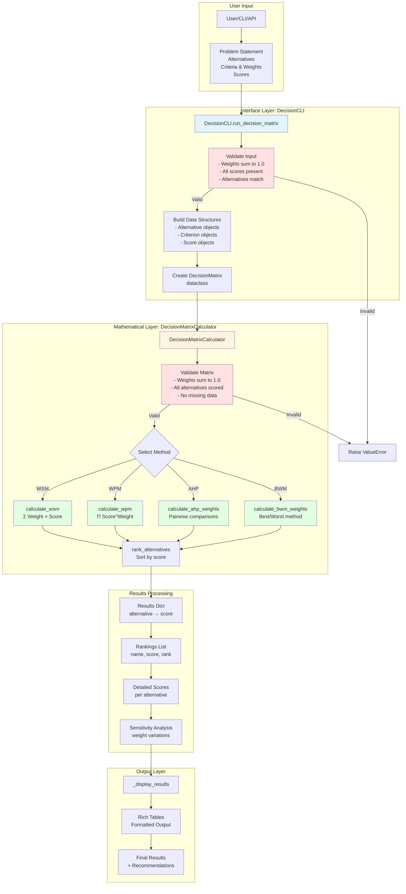
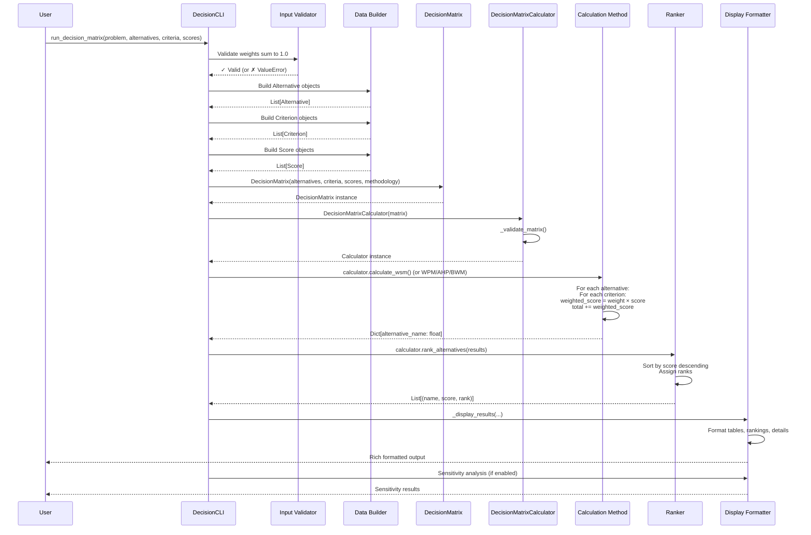

# Decision Engine Architecture - Complete Breakdown

**Purpose**: Bulletproof, interpretable, extensible decision matrix system for quantitative decision-making.

**Status**: Production-ready, fully documented, mathematically rigorous.

---

## Table of Contents

1. [System Overview](#system-overview)
2. [Architecture Diagram](#architecture-diagram)
3. [Data Flow](#data-flow)
4. [Component Breakdown](#component-breakdown)
5. [Mathematical Foundations](#mathematical-foundations)
6. [Validation & Error Handling](#validation--error-handling)
7. [Extensibility Guide](#extensibility-guide)
8. [Usage Examples](#usage-examples)
9. [Testing & Reliability](#testing--reliability)

---

## System Overview

The Decision Engine is a **two-layer system**:

1. **Mathematical Layer** (`decision_matrix.py`) - Pure calculation engine
   - No I/O, no side effects
   - Mathematical operations only
   - Fully testable and deterministic

2. **Interface Layer** (`decision_cli.py`) - User-facing interface
   - Handles input/output
   - Formats results
   - Provides standardized API

### Why This Architecture?

- **Separation of Concerns**: Math is separate from presentation
- **Testability**: Can test math without UI
- **Reusability**: Math engine can be used anywhere
- **Reliability**: Each layer has single responsibility
- **Extensibility**: Easy to add new methodologies or interfaces

---

## Architecture Diagram



---

## Data Flow

### Step-by-Step Execution Flow



---

## Component Breakdown

### 1. Data Structures (decision_matrix.py)

#### `Criterion` (Dataclass)
**Purpose**: Represents a single evaluation criterion

**Fields**:
- `name: str` - Criterion name (e.g., "Code Quality")
- `weight: float` - Importance weight (0.0-1.0, must sum to 1.0 across all criteria)
- `description: Optional[str]` - Optional description

**Why**: Encapsulates criterion data with type safety

**Example**:
```python
Criterion(name="Code Quality", weight=0.4, description="Maintainability and readability")
```

---

#### `Alternative` (Dataclass)
**Purpose**: Represents a decision option

**Fields**:
- `name: str` - Alternative name (e.g., "Refactor Now")
- `description: Optional[str]` - Optional description

**Why**: Encapsulates alternative data

**Example**:
```python
Alternative(name="Refactor Now", description="Refactor codebase before adding features")
```

---

#### `Score` (Dataclass)
**Purpose**: Represents a score for one alternative on one criterion

**Fields**:
- `alternative_name: str` - Which alternative
- `criterion_name: str` - Which criterion
- `score: float` - Score value (typically 1-10)
- `reasoning: Optional[str]` - Optional justification

**Why**: Links alternatives to criteria with scores

**Example**:
```python
Score(
    alternative_name="Refactor Now",
    criterion_name="Code Quality",
    score=9.0,
    reasoning="Eliminates technical debt"
)
```

---

#### `DecisionMatrix` (Dataclass)
**Purpose**: Complete decision problem representation

**Fields**:
- `alternatives: List[Alternative]` - All options
- `criteria: List[Criterion]` - All evaluation criteria
- `scores: List[Score]` - All alternative-criterion scores
- `methodology: str` - Calculation method ("WSM", "WPM", "AHP", "BWM")

**Why**: Immutable data structure containing entire problem

**Example**:
```python
DecisionMatrix(
    alternatives=[alt1, alt2, alt3],
    criteria=[crit1, crit2, crit3],
    scores=[score1, score2, ...],
    methodology="WSM"
)
```

---

### 2. Mathematical Engine (DecisionMatrixCalculator)

#### Initialization
```python
def __init__(self, matrix: DecisionMatrix):
    self.matrix = matrix
    self._validate_matrix()  # IMMEDIATE VALIDATION
```

**What it does**:
1. Stores the matrix
2. **Immediately validates** the matrix is complete and correct
3. Raises `ValueError` if invalid

**Why immediate validation**: Fail fast, don't proceed with bad data

---

#### Validation (`_validate_matrix`)

**Checks**:
1. **Weights sum to 1.0** (tolerance: ±0.01)
   ```python
   total_weight = sum(c.weight for c in self.matrix.criteria)
   if abs(total_weight - 1.0) > 0.01:
       raise ValueError(f"Weights must sum to 1.0, got {total_weight}")
   ```

2. **All alternatives scored on all criteria**
   ```python
   for alt in self.matrix.alternatives:
       for crit in self.matrix.criteria:
           matching_scores = [s for s in self.matrix.scores
                             if s.alternative_name == alt.name 
                             and s.criterion_name == crit.name]
           if not matching_scores:
               raise ValueError(f"Missing score for '{alt.name}' on '{crit.name}'")
   ```

**Why**: Ensures mathematical operations are valid

---

#### Weighted Sum Model (`calculate_wsm`)

**Formula**: `Total_Score = Σ (Weight_i × Score_i)` for all criteria

**Algorithm**:
```python
for each alternative:
    total_score = 0.0
    for each criterion:
        score_obj = find_score(alternative, criterion)
        weighted_score = criterion.weight × score_obj.score
        total_score += weighted_score
    results[alternative.name] = total_score
```

**Why WSM**: 
- Most intuitive (weighted average)
- Works for independent criteria
- Easy to interpret

**When to use**: Default choice for most decisions

---

#### Weighted Product Model (`calculate_wpm`)

**Formula**: `Total_Score = Π (Score_i ^ Weight_i)` for all criteria

**Algorithm**:
```python
for each alternative:
    total_score = 1.0
    for each criterion:
        score_obj = find_score(alternative, criterion)
        # Avoid zero scores (use 0.001 minimum)
        score_value = max(score_obj.score, 0.001)
        weighted_product = score_value ^ criterion.weight
        total_score *= weighted_product
    results[alternative.name] = total_score
```

**Why WPM**:
- Multiplicative relationship between criteria
- Avoids normalization issues
- Good for ratio-based decisions

**When to use**: When criteria have multiplicative relationships

---

#### Ranking (`rank_alternatives`)

**Algorithm**:
```python
sorted_items = sorted(scores.items(), key=lambda x: x[1], reverse=True)
ranked = [(name, score, rank + 1) for rank, (name, score) in enumerate(sorted_items)]
```

**Returns**: `List[Tuple[name, score, rank]]` sorted by score descending

**Why**: Provides ordered list with explicit ranks

---

### 3. Interface Layer (DecisionCLI)

#### `run_decision_matrix` - Main Entry Point

**Input Validation**:
```python
# 1. Validate weights sum to 1.0
total_weight = sum(criteria.values())
if abs(total_weight - 1.0) > 0.01:
    raise ValueError(f"Weights must sum to 1.0, got {total_weight}")

# 2. Validate all alternatives have scores
for alt_name, crit_scores in scores.items():
    if alt_name not in alternatives:
        raise ValueError(f"Alternative '{alt_name}' not in alternatives list")
    for crit_name, score_value in crit_scores.items():
        if crit_name not in criteria:
            raise ValueError(f"Criterion '{crit_name}' not in criteria")
```

**Data Building**:
```python
# Build Alternative objects
alt_objects = [Alternative(name) for name in alternatives]

# Build Criterion objects
crit_objects = []
for name, weight in criteria.items():
    description = (criterion_descriptions or {}).get(name)
    crit_objects.append(Criterion(name, weight, description))

# Build Score objects
score_objects = []
for alt_name, crit_scores in scores.items():
    for crit_name, score_value in crit_scores.items():
        score_objects.append(Score(alt_name, crit_name, score_value))
```

**Matrix Creation**:
```python
matrix = DecisionMatrix(alt_objects, crit_objects, score_objects, methodology=methodology)
```

**Calculation**:
```python
calculator = DecisionMatrixCalculator(matrix)  # Validates automatically

if methodology == "WSM":
    results = calculator.calculate_wsm()
elif methodology == "WPM":
    results = calculator.calculate_wpm()
else:
    raise ValueError(f"Unsupported methodology: {methodology}")

rankings = calculator.rank_alternatives(results)
```

**Why this structure**: Clear separation of validation, building, calculation, display

---

## Mathematical Foundations

### Weighted Sum Model (WSM)

**Formula**: 
```
Score(Alternative) = Σ (Weight_i × Score_i) for i in criteria
```

**Example**:
- Alternative: "Refactor Now"
- Criterion 1: "Code Quality" (weight=0.4, score=9.0) → 0.4 × 9.0 = 3.6
- Criterion 2: "Time to Market" (weight=0.6, score=4.0) → 0.6 × 4.0 = 2.4
- **Total**: 3.6 + 2.4 = 6.0

**Properties**:
- Linear combination
- Additive (independent criteria)
- Range: 0 to max(score_scale) × 1.0

---

### Weighted Product Model (WPM)

**Formula**:
```
Score(Alternative) = Π (Score_i ^ Weight_i) for i in criteria
```

**Example**:
- Alternative: "Refactor Now"
- Criterion 1: "Code Quality" (weight=0.4, score=9.0) → 9.0^0.4 = 2.408
- Criterion 2: "Time to Market" (weight=0.6, score=4.0) → 4.0^0.6 = 2.297
- **Total**: 2.408 × 2.297 = 5.53

**Properties**:
- Multiplicative combination
- Handles ratios well
- Zero scores problematic (handled with 0.001 minimum)

---

## Validation & Error Handling

### Input Validation (DecisionCLI)

**Layer 1: Type & Structure**
- Weights must be floats
- Scores must be floats
- Alternatives must be strings
- Criteria must be strings

**Layer 2: Business Logic**
- Weights sum to 1.0 (±0.01 tolerance)
- All alternatives have scores for all criteria
- No duplicate alternatives
- No duplicate criteria

**Error Messages**: Specific, actionable
```python
ValueError(f"Weights must sum to 1.0, got {total_weight}")
ValueError(f"Alternative '{alt_name}' not in alternatives list")
ValueError(f"Criterion '{crit_name}' not in criteria")
```

---

### Matrix Validation (DecisionMatrixCalculator)

**Layer 3: Completeness**
- All alternatives scored on all criteria
- No missing scores
- No orphaned scores

**Why three layers**: Defense in depth, catch errors early

---

## Extensibility Guide

### Adding a New Methodology

**Step 1**: Add method to `DecisionMatrixCalculator`
```python
def calculate_new_method(self) -> Dict[str, float]:
    """
    Calculate using New Method.
    
    Formula: [describe formula]
    
    Returns:
        Dictionary mapping alternative names to total scores
    """
    results = {}
    # Implementation here
    return results
```

**Step 2**: Update `calculate()` method
```python
def calculate(self, methodology: Optional[str] = None) -> Dict[str, float]:
    method = methodology or self.matrix.methodology
    if method == "WSM":
        return self.calculate_wsm()
    elif method == "WPM":
        return self.calculate_wpm()
    elif method == "NEW_METHOD":
        return self.calculate_new_method()  # Add this
    else:
        raise ValueError(f"Unknown methodology: {method}")
```

**Step 3**: Update `DecisionCLI.run_decision_matrix()`
```python
if methodology == "WSM":
    results = calculator.calculate_wsm()
elif methodology == "WPM":
    results = calculator.calculate_wpm()
elif methodology == "NEW_METHOD":
    results = calculator.calculate_new_method()  # Add this
else:
    raise ValueError(f"Unsupported methodology: {methodology}")
```

**Step 4**: Update documentation

---

### Adding a New Output Format

**Step 1**: Add method to `DecisionCLI`
```python
def _display_results_json(self, ...) -> str:
    """Display results as JSON."""
    import json
    return json.dumps({
        "problem": problem,
        "results": results,
        "rankings": rankings,
    }, indent=2)
```

**Step 2**: Add parameter to `run_decision_matrix`
```python
def run_decision_matrix(
    self,
    ...,
    output_format: str = "rich"  # Add this
):
    if output_format == "rich":
        self._display_results(...)
    elif output_format == "json":
        return self._display_results_json(...)
```

---

## Usage Examples

### Basic Usage

```python
from waft.core.decision_cli import DecisionCLI
from pathlib import Path

cli = DecisionCLI(Path('.'))

results = cli.run_decision_matrix(
    problem="Which feature to build next?",
    alternatives=["Feature A", "Feature B", "Feature C"],
    criteria={
        "User Value": 0.4,
        "Effort": 0.3,
        "Risk": 0.3
    },
    scores={
        "Feature A": {"User Value": 9, "Effort": 6, "Risk": 7},
        "Feature B": {"User Value": 7, "Effort": 8, "Risk": 6},
        "Feature C": {"User Value": 8, "Effort": 7, "Risk": 8},
    },
    methodology="WSM"
)

print(f"Recommended: {results['recommendation']}")
```

---

### Advanced Usage (Direct Calculator)

```python
from waft.core.decision_matrix import (
    DecisionMatrix, Alternative, Criterion, Score,
    DecisionMatrixCalculator
)

# Build matrix manually
matrix = DecisionMatrix(
    alternatives=[
        Alternative("Option A"),
        Alternative("Option B"),
    ],
    criteria=[
        Criterion("Criterion 1", 0.4),
        Criterion("Criterion 2", 0.6),
    ],
    scores=[
        Score("Option A", "Criterion 1", 8.0),
        Score("Option A", "Criterion 2", 7.0),
        Score("Option B", "Criterion 1", 6.0),
        Score("Option B", "Criterion 2", 9.0),
    ],
    methodology="WSM"
)

# Calculate
calculator = DecisionMatrixCalculator(matrix)
results = calculator.calculate_wsm()
rankings = calculator.rank_alternatives(results)

print(f"Winner: {rankings[0][0]} with score {rankings[0][1]:.2f}")
```

---

## Testing & Reliability

### Test Coverage Requirements

1. **Input Validation**
   - Weights don't sum to 1.0 → ValueError
   - Missing alternative → ValueError
   - Missing criterion → ValueError
   - Missing score → ValueError

2. **Mathematical Correctness**
   - WSM calculations correct
   - WPM calculations correct
   - Ranking correct (descending order)
   - Detailed scores correct

3. **Edge Cases**
   - Single alternative
   - Single criterion
   - All scores equal
   - Zero scores (WPM)
   - Very large scores
   - Very small weights

4. **Sensitivity Analysis**
   - Weight variations don't break
   - Results remain stable

---

## Key Design Principles

1. **Immutability**: Data structures are dataclasses (immutable by default)
2. **Validation**: Multiple layers of validation (fail fast)
3. **Separation**: Math separate from I/O
4. **Transparency**: All calculations visible and traceable
5. **Extensibility**: Easy to add methods or formats
6. **Reliability**: Type-safe, validated, tested

---

## File Structure

```
src/waft/core/
├── decision_matrix.py      # Mathematical engine (pure, no I/O)
│   ├── Criterion (dataclass)
│   ├── Alternative (dataclass)
│   ├── Score (dataclass)
│   ├── DecisionMatrix (dataclass)
│   └── DecisionMatrixCalculator (class)
│
└── decision_cli.py         # Interface layer (I/O, formatting)
    └── DecisionCLI (class)
        ├── run_decision_matrix()  # Main entry point
        └── _display_results()     # Output formatting
```

---

**This architecture ensures the decision engine is bulletproof, interpretable, extensible, and crystal clear in its operation.**
