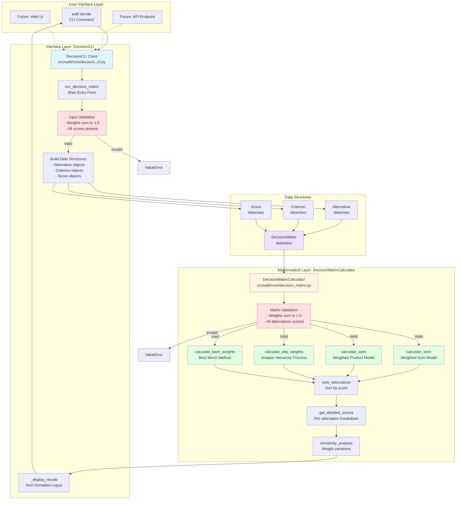
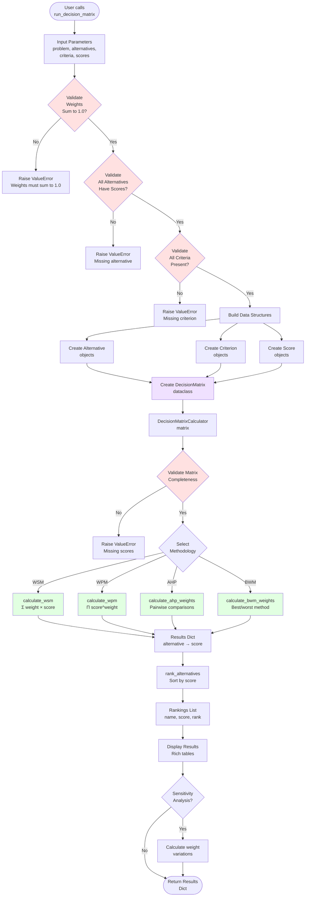
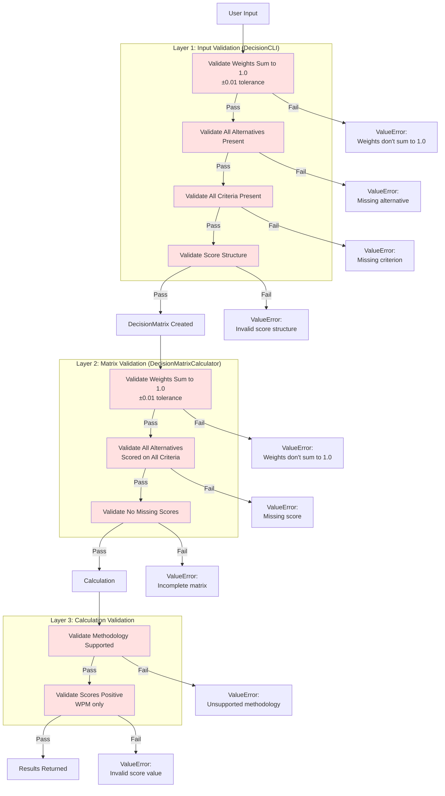
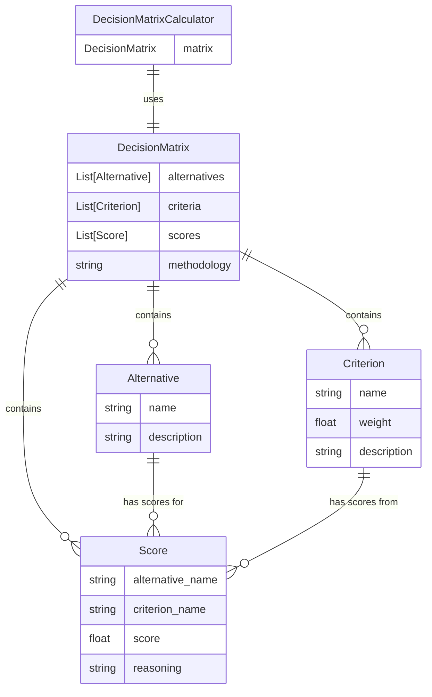
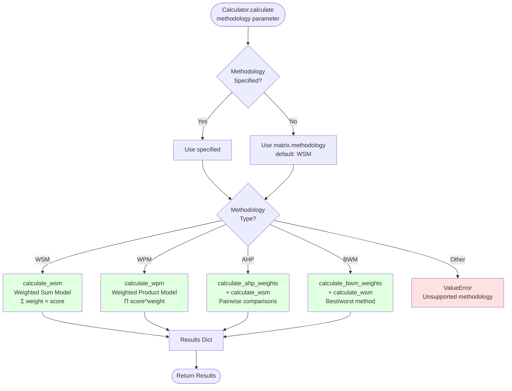
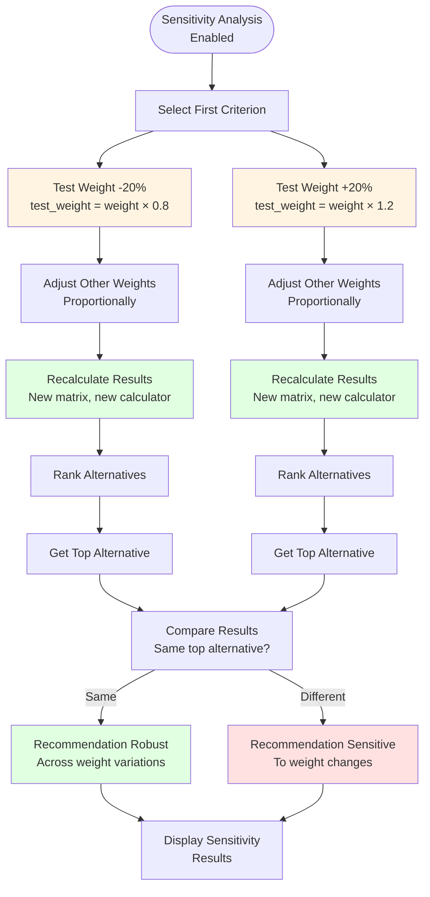
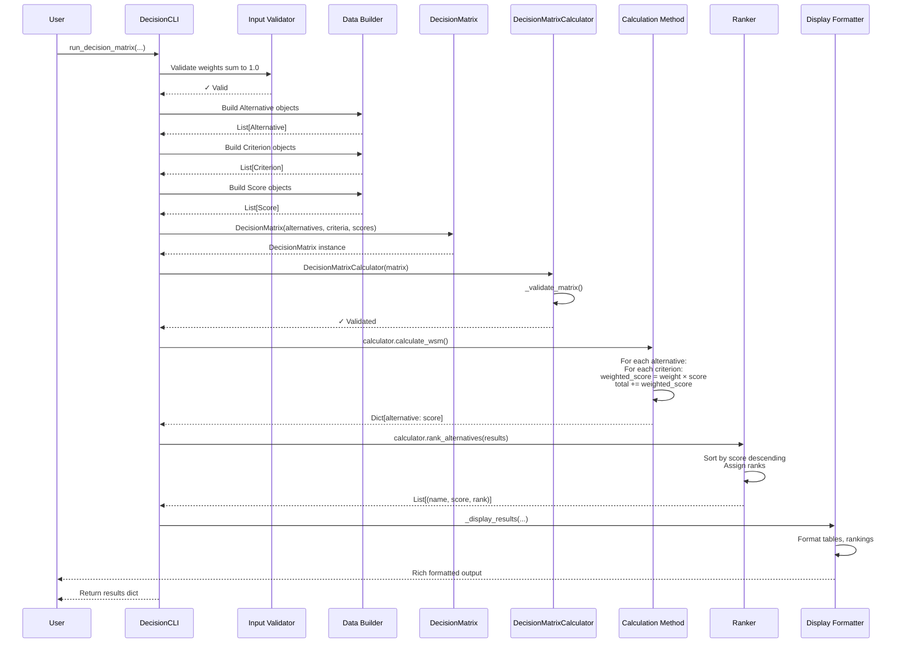
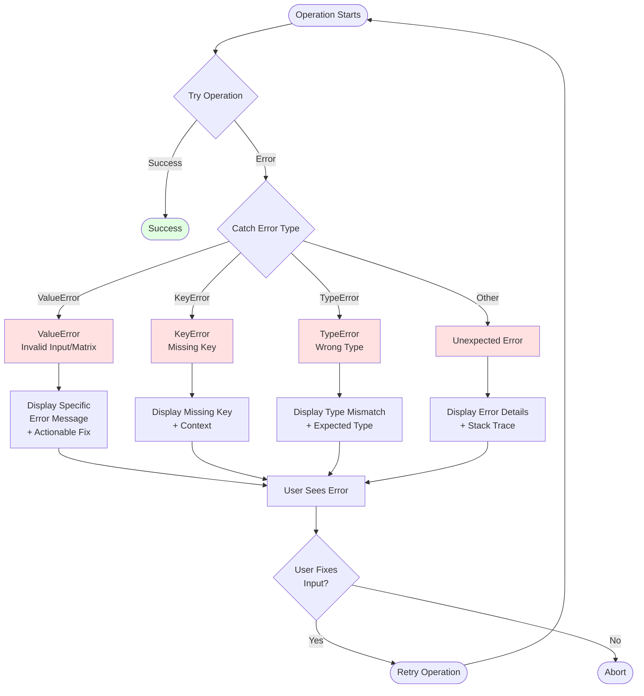

# Decision Engine - Complete Mermaid Diagrams

**Purpose**: Visual representation of the entire decision engine architecture, flow, and data structures.

---

## System Architecture Overview



---

## Complete Data Flow



---

## WSM Calculation Detail

```mermaid
flowchart TD
    Start([calculate_wsm called]) --> Init[Initialize results = {}]

    Init --> LoopAlt[For each alternative<br/>in matrix.alternatives]

    LoopAlt --> InitScore[total_score = 0.0]

    InitScore --> LoopCrit[For each criterion<br/>in matrix.criteria]

    LoopCrit --> FindScore[Find Score object<br/>matching alternative<br/>and criterion]

    FindScore --> Calc[Calculate weighted score<br/>weighted_score =<br/>criterion.weight ×<br/>score_obj.score]

    Calc --> Add[Add to total<br/>total_score +=<br/>weighted_score]

    Add --> MoreCrit{More<br/>criteria?}
    MoreCrit -->|Yes| LoopCrit
    MoreCrit -->|No| Store[Store result<br/>results[alt.name] =<br/>total_score]

    Store --> MoreAlt{More<br/>alternatives?}
    MoreAlt -->|Yes| LoopAlt
    MoreAlt -->|No| Return([Return results<br/>Dict[alt_name: score]])

    style Calc fill:#e1ffe1
    style FindScore fill:#fff4e1
```

---

## Validation Layers



---

## Data Structure Relationships



---

## Method Selection Flow



---

## Sensitivity Analysis Flow



---

## Component Interaction Sequence



---

## Error Handling Flow



---

**These diagrams show every aspect of the decision engine: architecture, flow, validation, calculations, and error handling.**
