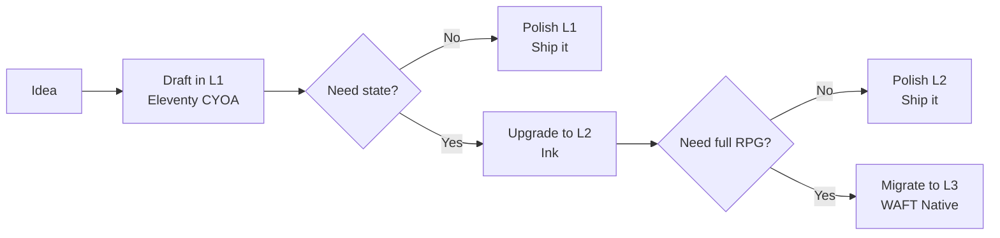

# WAFT Scenario Format Specification

A three-tier system for authoring interactive scenarios, from simple branching narratives to complex ML-driven gameplay.

## Philosophy

Different scenarios need different levels of complexity:
- **Drafting a story flow?** → Level 1 (simple branching)
- **Need inventory/state?** → Level 2 (conditionals + variables)
- **Want full RPG mechanics?** → Level 3 (WAFT native)

**You can start at Level 1 and upgrade later without losing content.**

---

## Level 1: Eleventy CYOA

**Best for**: Quick prototyping, branching narratives, decision trees, AI-generated content

### Format: Markdown + YAML Front Matter

Inspired by [Raymond Camden's Eleventy CYOA pattern](https://www.raymondcamden.com/2021/01/08/building-a-choose-your-own-adventure-site-with-eleventy).

```yaml
---
title: The Cave Entrance
choices:
  - text: Enter the dark cave
    path: dark_cave
  - text: Follow the river
    path: river_path
---

You stand before a mysterious cave. What do you do?
```

### Rules

1. **One node = One `.md` file**
2. **YAML front matter** defines title and choices
3. **Markdown content** is the narrative
4. **No choices = Ending node**
5. **File stem = Node ID** (e.g., `start.md` → node ID `start`)

### Validation

```python
from waft.core.scenario_formats import ElevntyCYOAParser

is_valid, errors = ElevntyCYOAParser.validate_scenario("path/to/scenario")
if not is_valid:
    print("Errors:", errors)
```

### Running

```python
scenario = ElevntyCYOAParser.load_scenario("path/to/scenario")
scenario.run_interactive()
```

### Limitations

- ❌ No state tracking (inventory, health, relationships)
- ❌ No conditionals (show choice X only if Y happened)
- ❌ No variables or randomness
- ❌ No character stats or progression

### When to Use

✅ **Use Level 1 for**:
- First-pass story drafting
- Simple decision trees (troubleshooting guides, tutorials)
- Non-mechanical branching content (lore, dialogue trees)
- AI-generated scenarios that need quick iteration

---

## Level 2: Ink Format (Future)

**Best for**: State-dependent branching, inventory systems, relationship tracking

### Format: Ink Script

[Ink](https://www.inklestudios.com/ink/) is Inkle's scripting language for interactive narratives.

```ink
VAR has_key = false
VAR relationship_with_guard = 0

You approach the locked door.

+ [Try to pick the lock]
    { has_key:
        You use your key to unlock the door.
    - else:
        The door is locked tight.
    }

+ [Bribe the guard] -> bribe_guard
```

### Capabilities

- ✅ Variables and state tracking
- ✅ Conditional content
- ✅ Inventory and flags
- ✅ Relationship scores
- ✅ Random events
- ⚠️ Limited RPG mechanics (no built-in dice/stats)

### Integration Plan

**Status**: Not yet implemented

**Proposed path**:
1. Add `inkpy` dependency to WAFT
2. Create `InkScenarioParser` in `scenario_formats/`
3. Support mixed L1/L2 scenarios (Ink can import from files)

### When to Use

✅ **Use Level 2 for**:
- Scenarios with inventory management
- Branching based on player choices/state
- Relationship/reputation systems
- Choice-gated content ("only show if player has item X")

---

## Level 3: WAFT Native

**Best for**: Full RPG experiences with AI-driven encounters and ML-based choice prediction

### Format: Python + ScenarioRealm

WAFT's existing DND scenario system with:
- ML-based decision tree recommendations
- D&D 5e mechanics (stats, dice, combat)
- Party management and state persistence
- Encounter generation
- Lore building

### Example

```python
from waft.core.dnd_scenario import ScenarioOrchestrator, ScenarioRealm

realm = ScenarioRealm(realm_dir="_realms/my_campaign")
orchestrator = ScenarioOrchestrator(realm)

# Run encounter with ML-driven choice recommendations
result = orchestrator.run_scenario(mode="encounter")
```

### Capabilities

- ✅ Full D&D 5e rules
- ✅ ML-based choice prediction
- ✅ Character stats and progression
- ✅ Party management
- ✅ Combat and encounters
- ✅ Persistent world state
- ✅ Lore generation

### Architecture

See existing implementation:
- `src/waft/core/dnd_scenario/scenario_orchestrator.py`
- `src/waft/core/scenario_decision_tree.py`
- `src/waft/core/dnd_scenario/scenario_realm.py`

### When to Use

✅ **Use Level 3 for**:
- Full RPG campaigns
- AI-driven encounters
- Complex character progression
- ML-enhanced gameplay

---

## Comparison Matrix

| Feature | Level 1 (Eleventy) | Level 2 (Ink) | Level 3 (WAFT Native) |
|---------|-------------------|--------------|---------------------|
| **Authoring Complexity** | ⭐ Trivial | ⭐⭐⭐ Medium | ⭐⭐⭐⭐⭐ Expert |
| **State Tracking** | ❌ | ✅ | ✅ |
| **Conditionals** | ❌ | ✅ | ✅ |
| **Variables** | ❌ | ✅ | ✅ |
| **RPG Mechanics** | ❌ | ⚠️ Partial | ✅ Full |
| **ML Integration** | ❌ | ❌ | ✅ |
| **D&D 5e Rules** | ❌ | ❌ | ✅ |
| **Version Control** | ✅ Excellent | ✅ Good | ⚠️ Complex |
| **AI Generation** | ✅ Perfect | ✅ Good | ⚠️ Challenging |
| **Quick Prototyping** | ✅ | ⚠️ | ❌ |

---

## Migration Path

### L1 → L2 (Eleventy to Ink)

**Goal**: Add state/conditionals without rewriting content

1. Convert Markdown nodes to Ink knots:
   ```ink
   === start ===
   You stand before a cave.
   + [Enter cave] -> dark_cave
   + [Follow river] -> river_path
   ```

2. Add state tracking as needed:
   ```ink
   VAR explored_cave = false

   === start ===
   { explored_cave:
       You return to the familiar cave entrance.
   - else:
       You stand before a mysterious cave.
   }
   ```

### L2 → L3 (Ink to WAFT Native)

**Goal**: Add full RPG mechanics and ML integration

1. Port Ink narrative to Python scenario nodes
2. Add D&D 5e mechanics (stats, dice, combat)
3. Integrate with ScenarioRealm for persistence
4. Enable ML-based choice recommendations
5. Add party management and encounter generation

---

## Recommended Workflow



**Principle**: Start simple, upgrade only when complexity is justified.

---

## CLI Integration

### Current State (L3 only)

```bash
waft scenario --mode encounter  # Run DND encounter scenario
```

### Proposed Enhancement

```bash
# Level 1 scenarios
waft scenario run path/to/scenario              # Auto-detect format
waft scenario validate path/to/scenario         # Validate graph
waft scenario new my_scenario --level 1         # Create L1 template

# Level 2 scenarios (future)
waft scenario run path/to/scenario.ink
waft scenario upgrade my_scenario --to-ink      # L1 → L2

# Level 3 scenarios (existing)
waft scenario --mode encounter                  # Run WAFT native
```

---

## Example: Same Story, Three Levels

### Level 1: Eleventy CYOA

**File**: `start.md`
```yaml
---
title: The Locked Door
choices:
  - text: Try to pick the lock
    path: pick_lock
  - text: Knock on the door
    path: knock
---

You face a locked door.
```

**File**: `pick_lock.md`
```yaml
---
title: Success!
---

You skillfully pick the lock and enter.
```

### Level 2: Ink (with state)

```ink
VAR has_lockpick = false
VAR lockpick_skill = 0

=== start ===
You face a locked door.

+ [Try to pick the lock]
    { has_lockpick and lockpick_skill > 2:
        You skillfully pick the lock and enter.
    - else:
        You fumble with the lock. It won't budge.
    }

+ [Knock on the door] -> knock
```

### Level 3: WAFT Native (with D&D mechanics)

```python
from waft.core.dnd_scenario import Encounter

encounter = Encounter(
    description="You face a locked door.",
    challenges=[
        Challenge(
            type="skill_check",
            skill="Sleight of Hand",
            dc=15,
            success="You pick the lock and enter.",
            failure="The lock won't budge."
        )
    ]
)
```

---

## Design Principles

1. **Start Simple**: L1 is intentionally minimal. No feature creep.
2. **Upgrade Path**: Content investment isn't wasted when upgrading.
3. **Format Clarity**: Each level has clear boundaries and use cases.
4. **Tooling Support**: Each level has validation and testing tools.
5. **AI-Friendly**: L1 is trivial for LLMs to generate correctly.

---

## References

- **Eleventy CYOA**: [Raymond Camden's blog post](https://www.raymondcamden.com/2021/01/08/building-a-choose-your-own-adventure-site-with-eleventy)
- **Ink Language**: [Inkle Studios Ink](https://www.inklestudies.com/ink/)
- **WAFT Native**: See `docs/` for DND scenario documentation

---

## Status

| Level | Status | Implementation |
|-------|--------|----------------|
| Level 1 (Eleventy) | ✅ **Complete** | `src/waft/core/scenario_formats/eleventy_cyoa.py` |
| Level 2 (Ink) | 📋 **Planned** | Not yet implemented |
| Level 3 (WAFT Native) | ✅ **Complete** | `src/waft/core/dnd_scenario/` |

---

## Contributing

Want to add a scenario format? Follow this pattern:

1. Create parser in `src/waft/core/scenario_formats/`
2. Implement validation method
3. Add to this spec with comparison table
4. Create example scenario in `examples/`
5. Add CLI integration

---

*Last updated: 2026-01-24*
